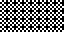
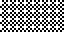
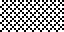
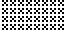
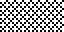

# 01 – Dither

Dither patterns.

## Gallery

| Pattern | Preview | Bitmap | Arduboy | Bitsy | PICO-8 | Playdate | Thumby |
| :------ | :-----: | :----: | :-----: | :---: | :----: | :------: | :----: |
| BayerDither00 |  | [png](png/BayerDither00.png) | [cpp](Dither.h#L14-L26) | [txt](Dither.bitsy.txt#L5-L14) | [p𝟪](dither.p8.lua#L7-L20) | [lua](Dither.playdate.lua#L7-L19) | [py](Dither.thumby.py#L7-L18) |
| BayerDither01 |  | [png](png/BayerDither01.png) | [cpp](Dither.h#L28-L40) | [txt](Dither.bitsy.txt#L16-L25) | [p𝟪](dither.p8.lua#L22-L35) | [lua](Dither.playdate.lua#L21-L33) | [py](Dither.thumby.py#L20-L31) |
| BayerDither02 |  | [png](png/BayerDither02.png) | [cpp](Dither.h#L42-L54) | [txt](Dither.bitsy.txt#L27-L36) | [p𝟪](dither.p8.lua#L37-L50) | [lua](Dither.playdate.lua#L35-L47) | [py](Dither.thumby.py#L33-L44) |
| BayerDither03 |  | [png](png/BayerDither03.png) | [cpp](Dither.h#L56-L68) | [txt](Dither.bitsy.txt#L38-L47) | [p𝟪](dither.p8.lua#L52-L65) | [lua](Dither.playdate.lua#L49-L61) | [py](Dither.thumby.py#L46-L57) |
| BayerDither04 |  | [png](png/BayerDither04.png) | [cpp](Dither.h#L70-L82) | [txt](Dither.bitsy.txt#L49-L58) | [p𝟪](dither.p8.lua#L67-L80) | [lua](Dither.playdate.lua#L63-L75) | [py](Dither.thumby.py#L59-L70) |
| BayerDither05 |  | [png](png/BayerDither05.png) | [cpp](Dither.h#L84-L96) | [txt](Dither.bitsy.txt#L60-L69) | [p𝟪](dither.p8.lua#L82-L95) | [lua](Dither.playdate.lua#L77-L89) | [py](Dither.thumby.py#L72-L83) |
| BayerDither06 |  | [png](png/BayerDither06.png) | [cpp](Dither.h#L98-L110) | [txt](Dither.bitsy.txt#L71-L80) | [p𝟪](dither.p8.lua#L97-L110) | [lua](Dither.playdate.lua#L91-L103) | [py](Dither.thumby.py#L85-L96) |
| BayerDither07 |  | [png](png/BayerDither07.png) | [cpp](Dither.h#L112-L124) | [txt](Dither.bitsy.txt#L82-L91) | [p𝟪](dither.p8.lua#L112-L125) | [lua](Dither.playdate.lua#L105-L117) | [py](Dither.thumby.py#L98-L109) |
| BayerDither08 p|  | [png](png/BayerDither08.png) | [cpp](Dither.h#L126-L138) | [txt](Dither.bitsy.txt#L93-L102) | [p𝟪](dither.p8.lua#L127-L140) | [lua](Dither.playdate.lua#L119-L131) | [py](Dither.thumby.py#L111-L122) |
| BayerDither09 |  | [png](png/BayerDither09.png) | [cpp](Dither.h#L140-L152) | [txt](Dither.bitsy.txt#L104-L113) | [p𝟪](dither.p8.lua#L142-L155) | [lua](Dither.playdate.lua#L133-L145) | [py](Dither.thumby.py#L124-L135) |
| BayerDither10 |  | [png](png/BayerDither10.png) | [cpp](Dither.h#L154-L166) | [txt](Dither.bitsy.txt#L115-L124) | [p𝟪](dither.p8.lua#L157-L170) | [lua](Dither.playdate.lua#L147-L159) | [py](Dither.thumby.py#L137-L148) |
| BayerDither11 |  | [png](png/BayerDither11.png) | [cpp](Dither.h#L168-L180) | [txt](Dither.bitsy.txt#L126-L135) | [p𝟪](dither.p8.lua#L172-L185) | [lua](Dither.playdate.lua#L161-L173) | [py](Dither.thumby.py#L150-L161) |
| BayerDither12 |  | [png](png/BayerDither12.png) | [cpp](Dither.h#L182-L194) | [txt](Dither.bitsy.txt#L137-L146) | [p𝟪](dither.p8.lua#L187-L200) | [lua](Dither.playdate.lua#L175-L187) | [py](Dither.thumby.py#L163-L174) |
| BayerDither13 |  | [png](png/BayerDither13.png) | [cpp](Dither.h#L196-L208) | [txt](Dither.bitsy.txt#L148-L157) | [p𝟪](dither.p8.lua#L202-L215) | [lua](Dither.playdate.lua#L189-L201) | [py](Dither.thumby.py#L176-L187) |
| BayerDither14 |  | [png](png/BayerDither14.png) | [cpp](Dither.h#L210-L222) | [txt](Dither.bitsy.txt#L159-L168) | [p𝟪](dither.p8.lua#L217-L230) | [lua](Dither.playdate.lua#L203-L215) | [py](Dither.thumby.py#L189-L200) |
| BayerDither15 |  | [png](png/BayerDither15.png) | [cpp](Dither.h#L224-L236) | [txt](Dither.bitsy.txt#L170-L179) | [p𝟪](dither.p8.lua#L232-L245) | [lua](Dither.playdate.lua#L217-L229) | [py](Dither.thumby.py#L202-L213) |
| BayerDither16 p|  | [png](png/BayerDither16.png) | [cpp](Dither.h#L238-L250) | [txt](Dither.bitsy.txt#L181-L190) | [p𝟪](dither.p8.lua#L247-L260) | [lua](Dither.playdate.lua#L231-L243) | [py](Dither.thumby.py#L215-L226) |

 

| Pattern | Preview | Bitmap | Arduboy | Bitsy | PICO-8 | Playdate | Thumby |
| :------ | :-----: | :----: | :-----: | :---: | :----: | :------: | :----: |
| OfficeDither05 o|  | [png](png/OfficeDither05.png) | [cpp](Dither.h#L252-L263) | [txt](Dither.bitsy.txt#L192-L201) | [p𝟪](dither.p8.lua#L262-L274) | [lua](Dither.playdate.lua#L245-L257) | [py](Dither.thumby.py#L228-L239) |
| OfficeDither10 o|  | [png](png/OfficeDither10.png) | [cpp](Dither.h#L265-L276) | [txt](Dither.bitsy.txt#L203-L212) | [p𝟪](dither.p8.lua#L276-L288) | [lua](Dither.playdate.lua#L259-L271) | [py](Dither.thumby.py#L241-L252) |
| OfficeDither20 o|  | [png](png/OfficeDither20.png) | [cpp](Dither.h#L278-L290) | [txt](Dither.bitsy.txt#L214-L223) | [p𝟪](dither.p8.lua#L290-L303) | [lua](Dither.playdate.lua#L273-L285) | [py](Dither.thumby.py#L254-L265) |
| OfficeDither25 o,p|  | [png](png/OfficeDither25.png) | [cpp](Dither.h#L292-L304) | [txt](Dither.bitsy.txt#L225-L234) | [p𝟪](dither.p8.lua#L305-L318) | [lua](Dither.playdate.lua#L287-L299) | [py](Dither.thumby.py#L267-L278) |
| OfficeDither30 o|  | [png](png/OfficeDither30.png) | [cpp](Dither.h#L306-L318) | [txt](Dither.bitsy.txt#L236-L245) | [p𝟪](dither.p8.lua#L320-L333) | [lua](Dither.playdate.lua#L301-L313) | [py](Dither.thumby.py#L280-L291) |
| OfficeDither40 o|  | [png](png/OfficeDither40.png) | [cpp](Dither.h#L320-L331) | [txt](Dither.bitsy.txt#L247-L256) | [p𝟪](dither.p8.lua#L335-L347) | [lua](Dither.playdate.lua#L315-L327) | [py](Dither.thumby.py#L293-L304) |
| OfficeDither50 o,p|  | [png](png/OfficeDither50.png) | [cpp](Dither.h#L333-L345) | [txt](Dither.bitsy.txt#L258-L267) | [p𝟪](dither.p8.lua#L349-L362) | [lua](Dither.playdate.lua#L329-L341) | [py](Dither.thumby.py#L306-L317) |
| OfficeDither60 o|  | [png](png/OfficeDither60.png) | [cpp](Dither.h#L347-L359) | [txt](Dither.bitsy.txt#L269-L278) | [p𝟪](dither.p8.lua#L364-L377) | [lua](Dither.playdate.lua#L343-L355) | [py](Dither.thumby.py#L319-L330) |
| OfficeDither70 o|  | [png](png/OfficeDither70.png) | [cpp](Dither.h#L361-L373) | [txt](Dither.bitsy.txt#L280-L289) | [p𝟪](dither.p8.lua#L379-L392) | [lua](Dither.playdate.lua#L357-L369) | [py](Dither.thumby.py#L332-L343) |
| OfficeDither75 o|  | [png](png/OfficeDither75.png) | [cpp](Dither.h#L375-L387) | [txt](Dither.bitsy.txt#L291-L300) | [p𝟪](dither.p8.lua#L394-L407) | [lua](Dither.playdate.lua#L371-L383) | [py](Dither.thumby.py#L345-L356) |
| OfficeDither80 o|  | [png](png/OfficeDither80.png) | [cpp](Dither.h#L389-L400) | [txt](Dither.bitsy.txt#L302-L311) | [p𝟪](dither.p8.lua#L409-L421) | [lua](Dither.playdate.lua#L385-L397) | [py](Dither.thumby.py#L358-L369) |
| OfficeDither90 o|  | [png](png/OfficeDither90.png) | [cpp](Dither.h#L402-L413) | [txt](Dither.bitsy.txt#L313-L322) | [p𝟪](dither.p8.lua#L423-L435) | [lua](Dither.playdate.lua#L399-L411) | [py](Dither.thumby.py#L371-L382) |

[`⤴`](#gallery)

---

o: Pattern included in the `Office` collection  
p: Pattern included in the `PICO-8` collection 

 
