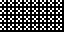
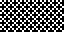
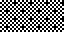

# 01 – Dither

Dither patterns.

## Gallery

| Pattern | Preview | Bitmap | Arduboy | Bitsy | PICO-8 | Thumby |
| :--- | :---: | :---: | :---: | :---: | :---: | :---: |
| BayerDither00 |  | [png](png/BayerDither00.png) | [cpp](Dither.h#L12-L24) | [txt](Dither.bitsy.txt#L5-L14) | [lua](dither.p8.lua#L7-L20) | [py](Dither.thumby.py#L5-L16) |
| BayerDither01 |  | [png](png/BayerDither01.png) | [cpp](Dither.h#L26-L38) | [txt](Dither.bitsy.txt#L16-L25) | [lua](dither.p8.lua#L22-L35) | [py](Dither.thumby.py#L18-L29) |
| BayerDither02 |  | [png](png/BayerDither02.png) | [cpp](Dither.h#L40-L52) | [txt](Dither.bitsy.txt#L27-L36) | [lua](dither.p8.lua#L37-L50) | [py](Dither.thumby.py#L31-L42) |
| BayerDither03 |  | [png](png/BayerDither03.png) | [cpp](Dither.h#L54-L66) | [txt](Dither.bitsy.txt#L38-L47) | [lua](dither.p8.lua#L52-L65) | [py](Dither.thumby.py#L44-L55) |
| BayerDither04 |  | [png](png/BayerDither04.png) | [cpp](Dither.h#L68-L80) | [txt](Dither.bitsy.txt#L49-L58) | [lua](dither.p8.lua#L67-L80) | [py](Dither.thumby.py#L57-L68) |
| BayerDither05 |  | [png](png/BayerDither05.png) | [cpp](Dither.h#L82-L94) | [txt](Dither.bitsy.txt#L60-L69) | [lua](dither.p8.lua#L82-L95) | [py](Dither.thumby.py#L70-L81) |
| BayerDither06 |  | [png](png/BayerDither06.png) | [cpp](Dither.h#L96-L108) | [txt](Dither.bitsy.txt#L71-L80) | [lua](dither.p8.lua#L97-L110) | [py](Dither.thumby.py#L83-L94) |
| BayerDither07 |  | [png](png/BayerDither07.png) | [cpp](Dither.h#L110-L122) | [txt](Dither.bitsy.txt#L82-L91) | [lua](dither.p8.lua#L112-L125) | [py](Dither.thumby.py#L96-L107) |
| BayerDither08 |  | [png](png/BayerDither08.png) | [cpp](Dither.h#L124-L136) | [txt](Dither.bitsy.txt#L93-L102) | [lua](dither.p8.lua#L127-L140) | [py](Dither.thumby.py#L109-L120) |
| BayerDither09 |  | [png](png/BayerDither09.png) | [cpp](Dither.h#L138-L150) | [txt](Dither.bitsy.txt#L104-L113) | [lua](dither.p8.lua#L142-L155) | [py](Dither.thumby.py#L122-L133) |
| BayerDither10 |  | [png](png/BayerDither10.png) | [cpp](Dither.h#L152-L164) | [txt](Dither.bitsy.txt#L115-L124) | [lua](dither.p8.lua#L157-L170) | [py](Dither.thumby.py#L135-L146) |
| BayerDither11 |  | [png](png/BayerDither11.png) | [cpp](Dither.h#L166-L178) | [txt](Dither.bitsy.txt#L126-L135) | [lua](dither.p8.lua#L172-L185) | [py](Dither.thumby.py#L148-L159) |
| BayerDither12 |  | [png](png/BayerDither12.png) | [cpp](Dither.h#L180-L192) | [txt](Dither.bitsy.txt#L137-L146) | [lua](dither.p8.lua#L187-L200) | [py](Dither.thumby.py#L161-L172) |
| BayerDither13 |  | [png](png/BayerDither13.png) | [cpp](Dither.h#L194-L206) | [txt](Dither.bitsy.txt#L148-L157) | [lua](dither.p8.lua#L202-L215) | [py](Dither.thumby.py#L174-L185) |
| BayerDither14 |  | [png](png/BayerDither14.png) | [cpp](Dither.h#L208-L220) | [txt](Dither.bitsy.txt#L159-L168) | [lua](dither.p8.lua#L217-L230) | [py](Dither.thumby.py#L187-L198) |
| BayerDither15 |  | [png](png/BayerDither15.png) | [cpp](Dither.h#L222-L234) | [txt](Dither.bitsy.txt#L170-L179) | [lua](dither.p8.lua#L232-L245) | [py](Dither.thumby.py#L200-L211) |
| BayerDither16 |  | [png](png/BayerDither16.png) | [cpp](Dither.h#L236-L248) | [txt](Dither.bitsy.txt#L181-L190) | [lua](dither.p8.lua#L247-L260) | [py](Dither.thumby.py#L213-L224) |

 

| Pattern | Preview | Bitmap | Arduboy | Bitsy | PICO-8 | Thumby |
| :--- | :---: | :---: | :---: | :---: | :---: | :---: |
| OfficeDither05 o|  | [png](png/OfficeDither05.png) | [cpp](Dither.h#L250-L261) | [txt](Dither.bitsy.txt#L192-L201) | [lua](dither.p8.lua#L262-L274) | [py](Dither.thumby.py#L226-L237) |
| OfficeDither10 o|  | [png](png/OfficeDither10.png) | [cpp](Dither.h#L263-L274) | [txt](Dither.bitsy.txt#L203-L212) | [lua](dither.p8.lua#L276-L288) | [py](Dither.thumby.py#L239-L250) |
| OfficeDither20 o|  | [png](png/OfficeDither20.png) | [cpp](Dither.h#L276-L288) | [txt](Dither.bitsy.txt#L214-L223) | [lua](dither.p8.lua#L290-L303) | [py](Dither.thumby.py#L252-L263) |
| OfficeDither25 o|  | [png](png/OfficeDither25.png) | [cpp](Dither.h#L290-L302) | [txt](Dither.bitsy.txt#L225-L234) | [lua](dither.p8.lua#L305-L318) | [py](Dither.thumby.py#L265-L276) |
| OfficeDither30 o|  | [png](png/OfficeDither30.png) | [cpp](Dither.h#L304-L316) | [txt](Dither.bitsy.txt#L236-L245) | [lua](dither.p8.lua#L320-L333) | [py](Dither.thumby.py#L278-L289) |
| OfficeDither40 o|  | [png](png/OfficeDither40.png) | [cpp](Dither.h#L318-L329) | [txt](Dither.bitsy.txt#L247-L256) | [lua](dither.p8.lua#L335-L347) | [py](Dither.thumby.py#L291-L302) |
| OfficeDither50 o|  | [png](png/OfficeDither50.png) | [cpp](Dither.h#L331-L343) | [txt](Dither.bitsy.txt#L258-L267) | [lua](dither.p8.lua#L349-L362) | [py](Dither.thumby.py#L304-L315) |
| OfficeDither60 o|  | [png](png/OfficeDither60.png) | [cpp](Dither.h#L345-L357) | [txt](Dither.bitsy.txt#L269-L278) | [lua](dither.p8.lua#L364-L377) | [py](Dither.thumby.py#L317-L328) |
| OfficeDither70 o|  | [png](png/OfficeDither70.png) | [cpp](Dither.h#L359-L371) | [txt](Dither.bitsy.txt#L280-L289) | [lua](dither.p8.lua#L379-L392) | [py](Dither.thumby.py#L330-L341) |
| OfficeDither75 o|  | [png](png/OfficeDither75.png) | [cpp](Dither.h#L373-L385) | [txt](Dither.bitsy.txt#L291-L300) | [lua](dither.p8.lua#L394-L407) | [py](Dither.thumby.py#L343-L354) |
| OfficeDither80 o|  | [png](png/OfficeDither80.png) | [cpp](Dither.h#L387-L398) | [txt](Dither.bitsy.txt#L302-L311) | [lua](dither.p8.lua#L409-L421) | [py](Dither.thumby.py#L356-L367) |
| OfficeDither90 o|  | [png](png/OfficeDither90.png) | [cpp](Dither.h#L400-L411) | [txt](Dither.bitsy.txt#L313-L322) | [lua](dither.p8.lua#L423-L435) | [py](Dither.thumby.py#L369-L380) |

[`⤴`](#gallery)

---

o: Pattern included in the `Office` collection  
p: Pattern included in the `PICO-8` collection 

 
