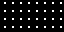
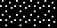

# 02 – Dots

Dot patterns.

## Gallery

| Pattern | Preview | Bitmap | Arduboy | Bitsy | PICO-8 | Thumby |
| :------ | :-----: | :----: | :-----: | :---: | :----: | :----: |
| Pixel |  | [png](png/Pixel.png) | [cpp](Dots.h#L12-L23) | [txt](Dots.bitsy.txt#L5-L14) | [p𝟪](dots.p8.lua#L7-L19) | [py](Dots.thumby.py#L5-L16) |
| PixelMini |  | [png](png/PixelMini.png) | [cpp](Dots.h#L25-L37) | [txt](Dots.bitsy.txt#L16-L25) | [p𝟪](dots.p8.lua#L21-L34) | [py](Dots.thumby.py#L18-L29) |
| Glisten |  | [png](png/Glisten.png) | [cpp](Dots.h#L39-L50) | [txt](Dots.bitsy.txt#L27-L36) | [p𝟪](dots.p8.lua#L36-L48) | [py](Dots.thumby.py#L31-L42) |
| FairyRing |  | [png](png/FairyRing.png) | [cpp](Dots.h#L52-L63) | [txt](Dots.bitsy.txt#L38-L47) | [p𝟪](dots.p8.lua#L50-L62) | [py](Dots.thumby.py#L44-L55) |
| Noise |  | [png](png/Noise.png) | [cpp](Dots.h#L65-L76) | [txt](Dots.bitsy.txt#L49-L58) | [p𝟪](dots.p8.lua#L64-L76) | [py](Dots.thumby.py#L57-L68) |
| Confetti o|  | [png](png/Confetti.png) | [cpp](Dots.h#L78-L89) | [txt](Dots.bitsy.txt#L60-L69) | [p𝟪](dots.p8.lua#L78-L90) | [py](Dots.thumby.py#L70-L81) |
| Static |  | [png](png/Static.png) | [cpp](Dots.h#L91-L102) | [txt](Dots.bitsy.txt#L71-L80) | [p𝟪](dots.p8.lua#L92-L104) | [py](Dots.thumby.py#L83-L94) |
| DiamondSpeckled |  | [png](png/DiamondSpeckled.png) | [cpp](Dots.h#L104-L115) | [txt](Dots.bitsy.txt#L82-L91) | [p𝟪](dots.p8.lua#L106-L118) | [py](Dots.thumby.py#L96-L107) |
| ConfettiLarge o|  | [png](png/ConfettiLarge.png) | [cpp](Dots.h#L117-L128) | [txt](Dots.bitsy.txt#L93-L102) | [p𝟪](dots.p8.lua#L120-L132) | [py](Dots.thumby.py#L109-L120) |

[`⤴`](#gallery)

---

o: Pattern included in the `Office` collection  
p: Pattern included in the `PICO-8` collection

 
