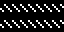
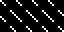
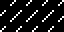
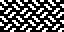

# 03 – Dashes

Dashed line patterns.

## Gallery

| Pattern | Preview | Bitmap | Arduboy | Bitsy | PICO-8 | Thumby |
| :--- | :---: | :---: | :---: | :---: | :---: | :---: |
| HorizontalDenseTrellis o|  | [png](png/HorizontalDenseTrellis.png) | [cpp](Dashes.h#L12-L24) | [txt](Dashes.bitsy.txt#L5-L14) | [lua](dashes.p8.lua#L7-L20) | [py](Dashes.thumby.py#L5-L16) |
| HorizontalDenseDotDash p|  | [png](png/HorizontalDenseDotDash.png) | [cpp](Dashes.h#L26-L38) | [txt](Dashes.bitsy.txt#L16-L25) | [lua](dashes.p8.lua#L22-L35) | [py](Dashes.thumby.py#L18-L29) |
| HorizontalDash o|  | [png](png/HorizontalDash.png) | [cpp](Dashes.h#L40-L51) | [txt](Dashes.bitsy.txt#L27-L36) | [lua](dashes.p8.lua#L37-L49) | [py](Dashes.thumby.py#L31-L42) |
| HorizontalDashMini p|  | [png](png/HorizontalDashMini.png) | [cpp](Dashes.h#L53-L65) | [txt](Dashes.bitsy.txt#L38-L47) | [lua](dashes.p8.lua#L51-L64) | [py](Dashes.thumby.py#L44-L55) |
| VerticalDash o|  | [png](png/VerticalDash.png) | [cpp](Dashes.h#L67-L78) | [txt](Dashes.bitsy.txt#L49-L58) | [lua](dashes.p8.lua#L66-L78) | [py](Dashes.thumby.py#L57-L68) |
| DexterDash o|  | [png](png/DexterDash.png) | [cpp](Dashes.h#L80-L91) | [txt](Dashes.bitsy.txt#L60-L69) | [lua](dashes.p8.lua#L80-L92) | [py](Dashes.thumby.py#L70-L81) |
| DexterSparseDash |  | [png](png/DexterSparseDash.png) | [cpp](Dashes.h#L93-L104) | [txt](Dashes.bitsy.txt#L71-L80) | [lua](dashes.p8.lua#L94-L106) | [py](Dashes.thumby.py#L83-L94) |
| SinisterDash o|  | [png](png/SinisterDash.png) | [cpp](Dashes.h#L106-L117) | [txt](Dashes.bitsy.txt#L82-L91) | [lua](dashes.p8.lua#L108-L120) | [py](Dashes.thumby.py#L96-L107) |
| SinisterSparseDash |  | [png](png/SinisterSparseDash.png) | [cpp](Dashes.h#L119-L130) | [txt](Dashes.bitsy.txt#L93-L102) | [lua](dashes.p8.lua#L122-L134) | [py](Dashes.thumby.py#L109-L120) |
| AlternatingDash |  | [png](png/AlternatingDash.png) | [cpp](Dashes.h#L132-L143) | [txt](Dashes.bitsy.txt#L104-L113) | [lua](dashes.p8.lua#L136-L148) | [py](Dashes.thumby.py#L122-L133) |
| AlternatingDashDouble |  | [png](png/AlternatingDashDouble.png) | [cpp](Dashes.h#L145-L156) | [txt](Dashes.bitsy.txt#L115-L124) | [lua](dashes.p8.lua#L150-L162) | [py](Dashes.thumby.py#L135-L146) |
| AlternatingDashMini |  | [png](png/AlternatingDashMini.png) | [cpp](Dashes.h#L158-L170) | [txt](Dashes.bitsy.txt#L126-L135) | [lua](dashes.p8.lua#L164-L177) | [py](Dashes.thumby.py#L148-L159) |

[`⤴`](#gallery)

---

o: Pattern included in the `Office` collection  
p: Pattern included in the `PICO-8` collection 

 
