# 04 – Lines

Line patterns.

## Gallery

| Pattern | Preview | Bitmap | Arduboy | Bitsy | PICO-8 | Playdate | Thumby |
| :------ | :-----: | :----: | :-----: | :---: | :----: | :------: | :----: |
| Horizontal |  | [png](png/Horizontal.png) | [cpp](Lines.h#L12-L24) | [txt](Lines.bitsy.txt#L5-L14) | [p𝟪](lines.p8.lua#L7-L20) | [lua](Lines.playdate.lua#L5-L17) | [py](Lines.thumby.py#L5-L16) |
| HorizontalMedium |  | [png](png/HorizontalMedium.png) | [cpp](Lines.h#L26-L38) | [txt](Lines.bitsy.txt#L16-L25) | [p𝟪](lines.p8.lua#L22-L35) | [lua](Lines.playdate.lua#L19-L31) | [py](Lines.thumby.py#L18-L29) |
| HorizontalBold |  | [png](png/HorizontalBold.png) | [cpp](Lines.h#L40-L52) | [txt](Lines.bitsy.txt#L27-L36) | [p𝟪](lines.p8.lua#L37-L50) | [lua](Lines.playdate.lua#L33-L45) | [py](Lines.thumby.py#L31-L42) |
| HorizontalSparse |  | [png](png/HorizontalSparse.png) | [cpp](Lines.h#L54-L65) | [txt](Lines.bitsy.txt#L38-L47) | [p𝟪](lines.p8.lua#L52-L64) | [lua](Lines.playdate.lua#L47-L59) | [py](Lines.thumby.py#L44-L55) |
| HorizontalSparseMedium |  | [png](png/HorizontalSparseMedium.png) | [cpp](Lines.h#L67-L78) | [txt](Lines.bitsy.txt#L49-L58) | [p𝟪](lines.p8.lua#L66-L78) | [lua](Lines.playdate.lua#L61-L73) | [py](Lines.thumby.py#L57-L68) |
| HorizontalSparseBold |  | [png](png/HorizontalSparseBold.png) | [cpp](Lines.h#L80-L91) | [txt](Lines.bitsy.txt#L60-L69) | [p𝟪](lines.p8.lua#L80-L92) | [lua](Lines.playdate.lua#L75-L87) | [py](Lines.thumby.py#L70-L81) |
| HorizontalSparseExtraBold |  | [png](png/HorizontalSparseExtraBold.png) | [cpp](Lines.h#L93-L104) | [txt](Lines.bitsy.txt#L71-L80) | [p𝟪](lines.p8.lua#L94-L106) | [lua](Lines.playdate.lua#L89-L101) | [py](Lines.thumby.py#L83-L94) |
| HorizontalSparseUltraBold |  | [png](png/HorizontalSparseUltraBold.png) | [cpp](Lines.h#L106-L117) | [txt](Lines.bitsy.txt#L82-L91) | [p𝟪](lines.p8.lua#L108-L120) | [lua](Lines.playdate.lua#L103-L115) | [py](Lines.thumby.py#L96-L107) |
| HorizontalStripes |  | [png](png/HorizontalStripes.png) | [cpp](Lines.h#L119-L130) | [txt](Lines.bitsy.txt#L93-L102) | [p𝟪](lines.p8.lua#L122-L134) | [lua](Lines.playdate.lua#L117-L129) | [py](Lines.thumby.py#L109-L120) |
| HorizontalPinstripe |  | [png](png/HorizontalPinstripe.png) | [cpp](Lines.h#L132-L143) | [txt](Lines.bitsy.txt#L104-L113) | [p𝟪](lines.p8.lua#L136-L148) | [lua](Lines.playdate.lua#L131-L143) | [py](Lines.thumby.py#L122-L133) |
| HorizontalPinstripeMedium |  | [png](png/HorizontalPinstripeMedium.png) | [cpp](Lines.h#L145-L156) | [txt](Lines.bitsy.txt#L115-L124) | [p𝟪](lines.p8.lua#L150-L162) | [lua](Lines.playdate.lua#L145-L157) | [py](Lines.thumby.py#L135-L146) |
| HorizontalDense |  | [png](png/HorizontalDense.png) | [cpp](Lines.h#L158-L170) | [txt](Lines.bitsy.txt#L126-L135) | [p𝟪](lines.p8.lua#L164-L177) | [lua](Lines.playdate.lua#L159-L171) | [py](Lines.thumby.py#L148-L159) |
| HorizontalDenseLineDot |  | [png](png/HorizontalDenseLineDot.png) | [cpp](Lines.h#L172-L184) | [txt](Lines.bitsy.txt#L137-L146) | [p𝟪](lines.p8.lua#L179-L192) | [lua](Lines.playdate.lua#L173-L185) | [py](Lines.thumby.py#L161-L172) |
| HorizontalDenseLineDash |  | [png](png/HorizontalDenseLineDash.png) | [cpp](Lines.h#L186-L198) | [txt](Lines.bitsy.txt#L148-L157) | [p𝟪](lines.p8.lua#L194-L207) | [lua](Lines.playdate.lua#L187-L199) | [py](Lines.thumby.py#L174-L185) |
| HorizontalLight |  | [png](png/HorizontalLight.png) | [cpp](Lines.h#L200-L212) | [txt](Lines.bitsy.txt#L159-L168) | [p𝟪](lines.p8.lua#L209-L222) | [lua](Lines.playdate.lua#L201-L213) | [py](Lines.thumby.py#L187-L198) |

 

| Pattern | Preview | Bitmap | Arduboy | Bitsy | PICO-8 | Playdate | Thumby |
| :------ | :-----: | :----: | :-----: | :---: | :----: | :------: | :----: |
| Vertical |  | [png](png/Vertical.png) | [cpp](Lines.h#L214-L226) | [txt](Lines.bitsy.txt#L170-L179) | [p𝟪](lines.p8.lua#L224-L237) | [lua](Lines.playdate.lua#L215-L227) | [py](Lines.thumby.py#L200-L211) |
| VerticalMedium |  | [png](png/VerticalMedium.png) | [cpp](Lines.h#L228-L240) | [txt](Lines.bitsy.txt#L181-L190) | [p𝟪](lines.p8.lua#L239-L252) | [lua](Lines.playdate.lua#L229-L241) | [py](Lines.thumby.py#L213-L224) |
| VerticalBold |  | [png](png/VerticalBold.png) | [cpp](Lines.h#L242-L254) | [txt](Lines.bitsy.txt#L192-L201) | [p𝟪](lines.p8.lua#L254-L267) | [lua](Lines.playdate.lua#L243-L255) | [py](Lines.thumby.py#L226-L237) |
| VerticalSparse |  | [png](png/VerticalSparse.png) | [cpp](Lines.h#L256-L267) | [txt](Lines.bitsy.txt#L203-L212) | [p𝟪](lines.p8.lua#L269-L281) | [lua](Lines.playdate.lua#L257-L269) | [py](Lines.thumby.py#L239-L250) |
| VerticalSparseMedium |  | [png](png/VerticalSparseMedium.png) | [cpp](Lines.h#L269-L280) | [txt](Lines.bitsy.txt#L214-L223) | [p𝟪](lines.p8.lua#L283-L295) | [lua](Lines.playdate.lua#L271-L283) | [py](Lines.thumby.py#L252-L263) |
| VerticalSparseBold |  | [png](png/VerticalSparseBold.png) | [cpp](Lines.h#L282-L293) | [txt](Lines.bitsy.txt#L225-L234) | [p𝟪](lines.p8.lua#L297-L309) | [lua](Lines.playdate.lua#L285-L297) | [py](Lines.thumby.py#L265-L276) |
| VerticalSparseExtraBold |  | [png](png/VerticalSparseExtraBold.png) | [cpp](Lines.h#L295-L306) | [txt](Lines.bitsy.txt#L236-L245) | [p𝟪](lines.p8.lua#L311-L323) | [lua](Lines.playdate.lua#L299-L311) | [py](Lines.thumby.py#L278-L289) |
| VerticalSparseUltraBold |  | [png](png/VerticalSparseUltraBold.png) | [cpp](Lines.h#L308-L319) | [txt](Lines.bitsy.txt#L247-L256) | [p𝟪](lines.p8.lua#L325-L337) | [lua](Lines.playdate.lua#L313-L325) | [py](Lines.thumby.py#L291-L302) |
| VerticalStripes |  | [png](png/VerticalStripes.png) | [cpp](Lines.h#L321-L332) | [txt](Lines.bitsy.txt#L258-L267) | [p𝟪](lines.p8.lua#L339-L351) | [lua](Lines.playdate.lua#L327-L339) | [py](Lines.thumby.py#L304-L315) |
| VerticalPinstripe |  | [png](png/VerticalPinstripe.png) | [cpp](Lines.h#L334-L345) | [txt](Lines.bitsy.txt#L269-L278) | [p𝟪](lines.p8.lua#L353-L365) | [lua](Lines.playdate.lua#L341-L353) | [py](Lines.thumby.py#L317-L328) |
| VerticalPinstripeMedium |  | [png](png/VerticalPinstripeMedium.png) | [cpp](Lines.h#L347-L358) | [txt](Lines.bitsy.txt#L280-L289) | [p𝟪](lines.p8.lua#L367-L379) | [lua](Lines.playdate.lua#L355-L367) | [py](Lines.thumby.py#L330-L341) |
| VerticalDense |  | [png](png/VerticalDense.png) | [cpp](Lines.h#L360-L372) | [txt](Lines.bitsy.txt#L291-L300) | [p𝟪](lines.p8.lua#L381-L394) | [lua](Lines.playdate.lua#L369-L381) | [py](Lines.thumby.py#L343-L354) |
| VerticalDenseLineDot |  | [png](png/VerticalDenseLineDot.png) | [cpp](Lines.h#L374-L386) | [txt](Lines.bitsy.txt#L302-L311) | [p𝟪](lines.p8.lua#L396-L409) | [lua](Lines.playdate.lua#L383-L395) | [py](Lines.thumby.py#L356-L367) |
| VerticalDenseLineDash |  | [png](png/VerticalDenseLineDash.png) | [cpp](Lines.h#L388-L400) | [txt](Lines.bitsy.txt#L313-L322) | [p𝟪](lines.p8.lua#L411-L424) | [lua](Lines.playdate.lua#L397-L409) | [py](Lines.thumby.py#L369-L380) |
| VerticalLight | 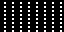 | [png](png/VerticalLight.png) | [cpp](Lines.h#L402-L414) | [txt](Lines.bitsy.txt#L324-L333) | [p𝟪](lines.p8.lua#L426-L439) | [lua](Lines.playdate.lua#L411-L423) | [py](Lines.thumby.py#L382-L393) |

 

| Pattern | Preview | Bitmap | Arduboy | Bitsy | PICO-8 | Playdate | Thumby |
| :------ | :-----: | :----: | :-----: | :---: | :----: | :------: | :----: |
| Dexter | 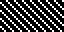 | [png](png/Dexter.png) | [cpp](Lines.h#L416-L428) | [txt](Lines.bitsy.txt#L335-L344) | [p𝟪](lines.p8.lua#L441-L454) | [lua](Lines.playdate.lua#L425-L437) | [py](Lines.thumby.py#L395-L406) |
| DexterMedium | 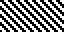 | [png](png/DexterMedium.png) | [cpp](Lines.h#L430-L442) | [txt](Lines.bitsy.txt#L346-L355) | [p𝟪](lines.p8.lua#L456-L469) | [lua](Lines.playdate.lua#L439-L451) | [py](Lines.thumby.py#L408-L419) |
| DexterBold |  | [png](png/DexterBold.png) | [cpp](Lines.h#L444-L456) | [txt](Lines.bitsy.txt#L357-L366) | [p𝟪](lines.p8.lua#L471-L484) | [lua](Lines.playdate.lua#L453-L465) | [py](Lines.thumby.py#L421-L432) |
| DexterSparse |  | [png](png/DexterSparse.png) | [cpp](Lines.h#L458-L469) | [txt](Lines.bitsy.txt#L368-L377) | [p𝟪](lines.p8.lua#L486-L498) | [lua](Lines.playdate.lua#L467-L479) | [py](Lines.thumby.py#L434-L445) |
| DexterSparseMedium | 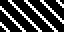 | [png](png/DexterSparseMedium.png) | [cpp](Lines.h#L471-L482) | [txt](Lines.bitsy.txt#L379-L388) | [p𝟪](lines.p8.lua#L500-L512) | [lua](Lines.playdate.lua#L481-L493) | [py](Lines.thumby.py#L447-L458) |
| DexterSparseBold | 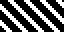 | [png](png/DexterSparseBold.png) | [cpp](Lines.h#L484-L495) | [txt](Lines.bitsy.txt#L390-L399) | [p𝟪](lines.p8.lua#L514-L526) | [lua](Lines.playdate.lua#L495-L507) | [py](Lines.thumby.py#L460-L471) |
| DexterSparseExtraBold |  | [png](png/DexterSparseExtraBold.png) | [cpp](Lines.h#L497-L508) | [txt](Lines.bitsy.txt#L401-L410) | [p𝟪](lines.p8.lua#L528-L540) | [lua](Lines.playdate.lua#L509-L521) | [py](Lines.thumby.py#L473-L484) |
| DexterSparseUltraBold | 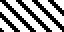 | [png](png/DexterSparseUltraBold.png) | [cpp](Lines.h#L510-L521) | [txt](Lines.bitsy.txt#L412-L421) | [p𝟪](lines.p8.lua#L542-L554) | [lua](Lines.playdate.lua#L523-L535) | [py](Lines.thumby.py#L486-L497) |
| DexterStripes |  | [png](png/DexterStripes.png) | [cpp](Lines.h#L523-L534) | [txt](Lines.bitsy.txt#L423-L432) | [p𝟪](lines.p8.lua#L556-L568) | [lua](Lines.playdate.lua#L537-L549) | [py](Lines.thumby.py#L499-L510) |
| DexterPinstripe |  | [png](png/DexterPinstripe.png) | [cpp](Lines.h#L536-L547) | [txt](Lines.bitsy.txt#L434-L443) | [p𝟪](lines.p8.lua#L570-L582) | [lua](Lines.playdate.lua#L551-L563) | [py](Lines.thumby.py#L512-L523) |
| DexterPinstripeMedium |  | [png](png/DexterPinstripeMedium.png) | [cpp](Lines.h#L549-L560) | [txt](Lines.bitsy.txt#L445-L454) | [p𝟪](lines.p8.lua#L584-L596) | [lua](Lines.playdate.lua#L565-L577) | [py](Lines.thumby.py#L525-L536) |
| DexterSteep | 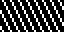 | [png](png/DexterSteep.png) | [cpp](Lines.h#L562-L573) | [txt](Lines.bitsy.txt#L456-L465) | [p𝟪](lines.p8.lua#L598-L610) | [lua](Lines.playdate.lua#L579-L591) | [py](Lines.thumby.py#L538-L549) |
| DexterSteepMedium | 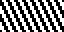 | [png](png/DexterSteepMedium.png) | [cpp](Lines.h#L575-L586) | [txt](Lines.bitsy.txt#L467-L476) | [p𝟪](lines.p8.lua#L612-L624) | [lua](Lines.playdate.lua#L593-L605) | [py](Lines.thumby.py#L551-L562) |
| DexterShallow |  | [png](png/DexterShallow.png) | [cpp](Lines.h#L588-L599) | [txt](Lines.bitsy.txt#L478-L487) | [p𝟪](lines.p8.lua#L626-L638) | [lua](Lines.playdate.lua#L607-L619) | [py](Lines.thumby.py#L564-L575) |
| DexterShallowMedium |  | [png](png/DexterShallowMedium.png) | [cpp](Lines.h#L601-L612) | [txt](Lines.bitsy.txt#L489-L498) | [p𝟪](lines.p8.lua#L640-L652) | [lua](Lines.playdate.lua#L621-L633) | [py](Lines.thumby.py#L577-L588) |

 

| Pattern | Preview | Bitmap | Arduboy | Bitsy | PICO-8 | Playdate | Thumby |
| :------ | :-----: | :----: | :-----: | :---: | :----: | :------: | :----: |
| Sinister | 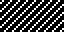 | [png](png/Sinister.png) | [cpp](Lines.h#L614-L626) | [txt](Lines.bitsy.txt#L500-L509) | [p𝟪](lines.p8.lua#L654-L667) | [lua](Lines.playdate.lua#L635-L647) | [py](Lines.thumby.py#L590-L601) |
| SinisterMedium |  | [png](png/SinisterMedium.png) | [cpp](Lines.h#L628-L640) | [txt](Lines.bitsy.txt#L511-L520) | [p𝟪](lines.p8.lua#L669-L682) | [lua](Lines.playdate.lua#L649-L661) | [py](Lines.thumby.py#L603-L614) |
| SinisterBold | 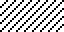 | [png](png/SinisterBold.png) | [cpp](Lines.h#L642-L654) | [txt](Lines.bitsy.txt#L522-L531) | [p𝟪](lines.p8.lua#L684-L697) | [lua](Lines.playdate.lua#L663-L675) | [py](Lines.thumby.py#L616-L627) |
| SinisterSparse |  | [png](png/SinisterSparse.png) | [cpp](Lines.h#L656-L667) | [txt](Lines.bitsy.txt#L533-L542) | [p𝟪](lines.p8.lua#L699-L711) | [lua](Lines.playdate.lua#L677-L689) | [py](Lines.thumby.py#L629-L640) |
| SinisterSparseMedium |  | [png](png/SinisterSparseMedium.png) | [cpp](Lines.h#L669-L680) | [txt](Lines.bitsy.txt#L544-L553) | [p𝟪](lines.p8.lua#L713-L725) | [lua](Lines.playdate.lua#L691-L703) | [py](Lines.thumby.py#L642-L653) |
| SinisterSparseBold |  | [png](png/SinisterSparseBold.png) | [cpp](Lines.h#L682-L693) | [txt](Lines.bitsy.txt#L555-L564) | [p𝟪](lines.p8.lua#L727-L739) | [lua](Lines.playdate.lua#L705-L717) | [py](Lines.thumby.py#L655-L666) |
| SinisterSparseExtraBold |  | [png](png/SinisterSparseExtraBold.png) | [cpp](Lines.h#L695-L706) | [txt](Lines.bitsy.txt#L566-L575) | [p𝟪](lines.p8.lua#L741-L753) | [lua](Lines.playdate.lua#L719-L731) | [py](Lines.thumby.py#L668-L679) |
| SinisterSparseUltraBold |  | [png](png/SinisterSparseUltraBold.png) | [cpp](Lines.h#L708-L719) | [txt](Lines.bitsy.txt#L577-L586) | [p𝟪](lines.p8.lua#L755-L767) | [lua](Lines.playdate.lua#L733-L745) | [py](Lines.thumby.py#L681-L692) |
| SinisterStripes |  | [png](png/SinisterStripes.png) | [cpp](Lines.h#L721-L732) | [txt](Lines.bitsy.txt#L588-L597) | [p𝟪](lines.p8.lua#L769-L781) | [lua](Lines.playdate.lua#L747-L759) | [py](Lines.thumby.py#L694-L705) |
| SinisterPinstripe |  | [png](png/SinisterPinstripe.png) | [cpp](Lines.h#L734-L745) | [txt](Lines.bitsy.txt#L599-L608) | [p𝟪](lines.p8.lua#L783-L795) | [lua](Lines.playdate.lua#L761-L773) | [py](Lines.thumby.py#L707-L718) |
| SinisterPinstripeMedium |  | [png](png/SinisterPinstripeMedium.png) | [cpp](Lines.h#L747-L758) | [txt](Lines.bitsy.txt#L610-L619) | [p𝟪](lines.p8.lua#L797-L809) | [lua](Lines.playdate.lua#L775-L787) | [py](Lines.thumby.py#L720-L731) |
| SinisterSteep | 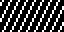 | [png](png/SinisterSteep.png) | [cpp](Lines.h#L760-L771) | [txt](Lines.bitsy.txt#L621-L630) | [p𝟪](lines.p8.lua#L811-L823) | [lua](Lines.playdate.lua#L789-L801) | [py](Lines.thumby.py#L733-L744) |
| SinisterSteepMedium | 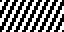 | [png](png/SinisterSteepMedium.png) | [cpp](Lines.h#L773-L784) | [txt](Lines.bitsy.txt#L632-L641) | [p𝟪](lines.p8.lua#L825-L837) | [lua](Lines.playdate.lua#L803-L815) | [py](Lines.thumby.py#L746-L757) |
| SinisterShallow |  | [png](png/SinisterShallow.png) | [cpp](Lines.h#L786-L797) | [txt](Lines.bitsy.txt#L643-L652) | [p𝟪](lines.p8.lua#L839-L851) | [lua](Lines.playdate.lua#L817-L829) | [py](Lines.thumby.py#L759-L770) |
| SinisterShallowMedium |  | [png](png/SinisterShallowMedium.png) | [cpp](Lines.h#L799-L810) | [txt](Lines.bitsy.txt#L654-L663) | [p𝟪](lines.p8.lua#L853-L865) | [lua](Lines.playdate.lua#L831-L843) | [py](Lines.thumby.py#L772-L783) |

[`⤴`](#gallery)

---

o: Pattern included in the `Office` collection  
p: Pattern included in the `PICO-8` collection 

 
