# 05 – Waves

Wave patterns.

## Gallery

| Pattern | Preview | Bitmap | Arduboy | Bitsy | PICO-8 | Playdate | Thumby |
| :------ | :-----: | :----: | :-----: | :---: | :----: | :------: | :----: |
| RippleLight | 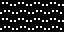 | [png](png/RippleLight.png) | [cpp](Waves.h#L12-L23) | [txt](Waves.bitsy.txt#L5-L14) | [p𝟪](waves.p8.lua#L7-L19) | [lua](Waves.playdate.lua#L5-L17) | [py](Waves.thumby.py#L5-L16) |
| Ripple |  | [png](png/Ripple.png) | [cpp](Waves.h#L25-L36) | [txt](Waves.bitsy.txt#L16-L25) | [p𝟪](waves.p8.lua#L21-L33) | [lua](Waves.playdate.lua#L19-L31) | [py](Waves.thumby.py#L18-L29) |
| Wave o| 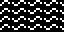 | [png](png/Wave.png) | [cpp](Waves.h#L38-L49) | [txt](Waves.bitsy.txt#L27-L36) | [p𝟪](waves.p8.lua#L35-L47) | [lua](Waves.playdate.lua#L33-L45) | [py](Waves.thumby.py#L31-L42) |
| TidalLight | 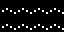 | [png](png/TidalLight.png) | [cpp](Waves.h#L51-L62) | [txt](Waves.bitsy.txt#L38-L47) | [p𝟪](waves.p8.lua#L49-L61) | [lua](Waves.playdate.lua#L47-L59) | [py](Waves.thumby.py#L44-L55) |
| Tidal |  | [png](png/Tidal.png) | [cpp](Waves.h#L64-L75) | [txt](Waves.bitsy.txt#L49-L58) | [p𝟪](waves.p8.lua#L63-L75) | [lua](Waves.playdate.lua#L61-L73) | [py](Waves.thumby.py#L57-L68) |
| TidalMedium | 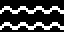 | [png](png/TidalMedium.png) | [cpp](Waves.h#L77-L88) | [txt](Waves.bitsy.txt#L60-L69) | [p𝟪](waves.p8.lua#L77-L89) | [lua](Waves.playdate.lua#L75-L87) | [py](Waves.thumby.py#L70-L81) |
| OceanicLight | 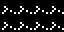 | [png](png/OceanicLight.png) | [cpp](Waves.h#L90-L101) | [txt](Waves.bitsy.txt#L71-L80) | [p𝟪](waves.p8.lua#L91-L103) | [lua](Waves.playdate.lua#L89-L101) | [py](Waves.thumby.py#L83-L94) |
| Oceanic | 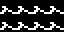 | [png](png/Oceanic.png) | [cpp](Waves.h#L103-L114) | [txt](Waves.bitsy.txt#L82-L91) | [p𝟪](waves.p8.lua#L105-L117) | [lua](Waves.playdate.lua#L103-L115) | [py](Waves.thumby.py#L96-L107) |

 

| Pattern | Preview | Bitmap | Arduboy | Bitsy | PICO-8 | Playdate | Thumby |
| :------ | :-----: | :----: | :-----: | :---: | :----: | :------: | :----: |
| ZigzagMini |  | [png](png/ZigzagMini.png) | [cpp](Waves.h#L116-L128) | [txt](Waves.bitsy.txt#L93-L102) | [p𝟪](waves.p8.lua#L119-L132) | [lua](Waves.playdate.lua#L117-L129) | [py](Waves.thumby.py#L109-L120) |
| ZigzagMiniMedium |  | [png](png/ZigzagMiniMedium.png) | [cpp](Waves.h#L130-L142) | [txt](Waves.bitsy.txt#L104-L113) | [p𝟪](waves.p8.lua#L134-L147) | [lua](Waves.playdate.lua#L131-L143) | [py](Waves.thumby.py#L122-L133) |
| Zigzag | 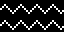 | [png](png/Zigzag.png) | [cpp](Waves.h#L144-L155) | [txt](Waves.bitsy.txt#L115-L124) | [p𝟪](waves.p8.lua#L149-L161) | [lua](Waves.playdate.lua#L145-L157) | [py](Waves.thumby.py#L135-L146) |
| ZigzagMedium | 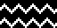 | [png](png/ZigzagMedium.png) | [cpp](Waves.h#L157-L168) | [txt](Waves.bitsy.txt#L126-L135) | [p𝟪](waves.p8.lua#L163-L175) | [lua](Waves.playdate.lua#L159-L171) | [py](Waves.thumby.py#L148-L159) |
| ZigzagBold |  | [png](png/ZigzagBold.png) | [cpp](Waves.h#L170-L181) | [txt](Waves.bitsy.txt#L137-L146) | [p𝟪](waves.p8.lua#L177-L189) | [lua](Waves.playdate.lua#L173-L185) | [py](Waves.thumby.py#L161-L172) |
| ZigzagBoldShaded |  | [png](png/ZigzagBoldShaded.png) | [cpp](Waves.h#L183-L194) | [txt](Waves.bitsy.txt#L148-L157) | [p𝟪](waves.p8.lua#L191-L203) | [lua](Waves.playdate.lua#L187-L199) | [py](Waves.thumby.py#L174-L185) |
| ZigzagExtraBold |  | [png](png/ZigzagExtraBold.png) | [cpp](Waves.h#L196-L207) | [txt](Waves.bitsy.txt#L159-L168) | [p𝟪](waves.p8.lua#L205-L217) | [lua](Waves.playdate.lua#L201-L213) | [py](Waves.thumby.py#L187-L198) |
| ZigzagPinstripe |  | [png](png/ZigzagPinstripe.png) | [cpp](Waves.h#L209-L220) | [txt](Waves.bitsy.txt#L170-L179) | [p𝟪](waves.p8.lua#L219-L231) | [lua](Waves.playdate.lua#L215-L227) | [py](Waves.thumby.py#L200-L211) |
| ZigzagSteep | 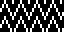 | [png](png/ZigzagSteep.png) | [cpp](Waves.h#L222-L233) | [txt](Waves.bitsy.txt#L181-L190) | [p𝟪](waves.p8.lua#L233-L245) | [lua](Waves.playdate.lua#L229-L241) | [py](Waves.thumby.py#L213-L224) |

 

| Pattern | Preview | Bitmap | Arduboy | Bitsy | PICO-8 | Playdate | Thumby |
| :------ | :-----: | :----: | :-----: | :---: | :----: | :------: | :----: |
| Dentilly |  | [png](png/Dentilly.png) | [cpp](Waves.h#L235-L246) | [txt](Waves.bitsy.txt#L192-L201) | [p𝟪](waves.p8.lua#L247-L259) | [lua](Waves.playdate.lua#L243-L255) | [py](Waves.thumby.py#L226-L237) |
| DentillyMini | 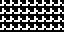 | [png](png/DentillyMini.png) | [cpp](Waves.h#L248-L260) | [txt](Waves.bitsy.txt#L203-L212) | [p𝟪](waves.p8.lua#L261-L274) | [lua](Waves.playdate.lua#L257-L269) | [py](Waves.thumby.py#L239-L250) |
| Urdy |  | [png](png/Urdy.png) | [cpp](Waves.h#L262-L273) | [txt](Waves.bitsy.txt#L214-L223) | [p𝟪](waves.p8.lua#L276-L288) | [lua](Waves.playdate.lua#L271-L283) | [py](Waves.thumby.py#L252-L263) |
| UrdyMini | 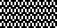 | [png](png/UrdyMini.png) | [cpp](Waves.h#L275-L287) | [txt](Waves.bitsy.txt#L225-L234) | [p𝟪](waves.p8.lua#L290-L303) | [lua](Waves.playdate.lua#L285-L297) | [py](Waves.thumby.py#L265-L276) |
| EmbattledGrady | 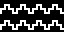 | [png](png/EmbattledGrady.png) | [cpp](Waves.h#L289-L300) | [txt](Waves.bitsy.txt#L236-L245) | [p𝟪](waves.p8.lua#L305-L317) | [lua](Waves.playdate.lua#L299-L311) | [py](Waves.thumby.py#L278-L289) |
| Embattled |  | [png](png/Embattled.png) | [cpp](Waves.h#L302-L313) | [txt](Waves.bitsy.txt#L247-L256) | [p𝟪](waves.p8.lua#L319-L331) | [lua](Waves.playdate.lua#L313-L325) | [py](Waves.thumby.py#L291-L302) |
| EmbattledMini | 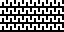 | [png](png/EmbattledMini.png) | [cpp](Waves.h#L315-L327) | [txt](Waves.bitsy.txt#L258-L267) | [p𝟪](waves.p8.lua#L333-L346) | [lua](Waves.playdate.lua#L327-L339) | [py](Waves.thumby.py#L304-L315) |
| Potenty | 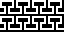 | [png](png/Potenty.png) | [cpp](Waves.h#L329-L340) | [txt](Waves.bitsy.txt#L269-L278) | [p𝟪](waves.p8.lua#L348-L360) | [lua](Waves.playdate.lua#L341-L353) | [py](Waves.thumby.py#L317-L328) |
| PotentyMini |  | [png](png/PotentyMini.png) | [cpp](Waves.h#L342-L354) | [txt](Waves.bitsy.txt#L280-L289) | [p𝟪](waves.p8.lua#L362-L375) | [lua](Waves.playdate.lua#L355-L367) | [py](Waves.thumby.py#L330-L341) |

 

| Pattern | Preview | Bitmap | Arduboy | Bitsy | PICO-8 | Playdate | Thumby | UDG |
| :------ | :-----: | :----: | :-----: | :---: | :----: | :------: | :----: | :-: |
| Serpentine | 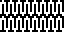 | [png](png/Serpentine.png) | [cpp](Waves.h#L356-L367) | [txt](Waves.bitsy.txt#L291-L300) | [p𝟪](waves.p8.lua#L377-L389) | [lua](Waves.playdate.lua#L369-L381) | [py](Waves.thumby.py#L343-L354) |
| Rising | 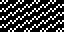 | [png](png/Rising.png) | [cpp](Waves.h#L369-L380) | [txt](Waves.bitsy.txt#L302-L311) | [p𝟪](waves.p8.lua#L391-L403) | [lua](Waves.playdate.lua#L383-L395) | [py](Waves.thumby.py#L356-L367) |
| RiseAndFall | 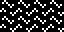 | [png](png/RiseAndFall.png) | [cpp](Waves.h#L382-L393) | [txt](Waves.bitsy.txt#L313-L322) | [p𝟪](waves.p8.lua#L405-L417) | [lua](Waves.playdate.lua#L397-L409) | [py](Waves.thumby.py#L369-L380) |
| DoubleHelix |  | [png](png/DoubleHelix.png) | [cpp](Waves.h#L395-L406) | [txt](Waves.bitsy.txt#L324-L333) | [p𝟪](waves.p8.lua#L419-L431) | [lua](Waves.playdate.lua#L411-L423) | [py](Waves.thumby.py#L382-L393) |

[`⤴`](#gallery)

---

o: Pattern included in the `Office` collection  
p: Pattern included in the `PICO-8` collection

 
