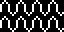

# 05 – Waves

Wave patterns.

## Gallery

| Pattern | Preview | Bitmap | Arduboy | Bitsy | PICO-8 | Thumby |
| :--- | :---: | :---: | :---: | :---: | :---: | :---: |
| Ripple |  | [png](png/Ripple.png) | cpp | txt | lua | py
| Wave o|  | [png](png/Wave.png) | cpp | txt | lua | py
| TidalLight |  | [png](png/TidalLight.png) | cpp | txt | lua | py
| Tidal |  | [png](png/Tidal.png) | cpp | txt | lua | py
| TidalMedium |  | [png](png/TidalMedium.png) | cpp | txt | lua | py
| OceanicLight |  | [png](png/OceanicLight.png) | cpp | txt | lua | py
| Oceanic |  | [png](png/Oceanic.png) | cpp | txt | lua | py
| VairPoint |  | [png](png/VairPoint.png) | cpp | txt | lua | py
| DoubleHelix |  | [png](png/DoubleHelix.png) | cpp | txt | lua | py

[`⤴`](#gallery)

---

o: Pattern included in the `Office` collection  
p: Pattern included in the `PICO-8` collection 

 
