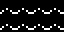
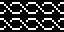
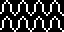

# 05 – Waves

Wave patterns.

## Gallery

| Pattern | Preview | Bitmap | Arduboy | Bitsy | PICO-8 | Thumby |
| :--- | :---: | :---: | :---: | :---: | :---: | :---: |
| Ripple |  | [png](png/Ripple.png) | [cpp](Waves.h#L12-L23) | [txt](Waves.bitsy.txt#L5-L14) | [lua](waves.p8.lua#L7-L19) | [py](Waves.thumby.py#L5-L16) |
| Wave o|  | [png](png/Wave.png) | [cpp](Waves.h#L25-L36) | [txt](Waves.bitsy.txt#L16-L25) | [lua](waves.p8.lua#L21-L33) | [py](Waves.thumby.py#L18-L29) |
| TidalLight |  | [png](png/TidalLight.png) | [cpp](Waves.h#L38-L49) | [txt](Waves.bitsy.txt#L27-L36) | [lua](waves.p8.lua#L35-L47) | [py](Waves.thumby.py#L31-L42) |
| Tidal |  | [png](png/Tidal.png) | [cpp](Waves.h#L51-L62) | [txt](Waves.bitsy.txt#L38-L47) | [lua](waves.p8.lua#L49-L61) | [py](Waves.thumby.py#L44-L55) |
| TidalMedium |  | [png](png/TidalMedium.png) | [cpp](Waves.h#L64-L75) | [txt](Waves.bitsy.txt#L49-L58) | [lua](waves.p8.lua#L63-L75) | [py](Waves.thumby.py#L57-L68) |
| OceanicLight |  | [png](png/OceanicLight.png) | [cpp](Waves.h#L77-L88) | [txt](Waves.bitsy.txt#L60-L69) | [lua](waves.p8.lua#L77-L89) | [py](Waves.thumby.py#L70-L81) |
| Oceanic |  | [png](png/Oceanic.png) | [cpp](Waves.h#L90-L101) | [txt](Waves.bitsy.txt#L71-L80) | [lua](waves.p8.lua#L91-L103) | [py](Waves.thumby.py#L83-L94) |

 

| Pattern | Preview | Bitmap | Arduboy | Bitsy | PICO-8 | Thumby |
| :--- | :---: | :---: | :---: | :---: | :---: | :---: |
| DoubleHelix |  | [png](png/DoubleHelix.png) | [cpp](Waves.h#L116-L127) | [txt](Waves.bitsy.txt#L93-L102) | [lua](waves.p8.lua#L119-L131) | [py](Waves.thumby.py#L109-L120) |
| Urdy |  | [png](png/Urdy.png) | [cpp](Waves.h#L103-L114) | [txt](Waves.bitsy.txt#L82-L91) | [lua](waves.p8.lua#L105-L117) | [py](Waves.thumby.py#L96-L107) |

[`⤴`](#gallery)

---

o: Pattern included in the `Office` collection  
p: Pattern included in the `PICO-8` collection 

 
