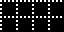
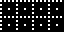
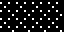
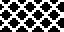
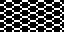
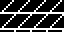

# 06 – Grid

Grid patterns.

## Gallery

| Pattern | Preview | Bitmap | Arduboy | Bitsy | PICO-8 | Thumby |
| :--- | :---: | :---: | :---: | :---: | :---: | :---: |
| GridDots o|  | [png](png/GridDots.png) | [cpp](Grid.h#L12-L23) | [txt](Grid.bitsy.txt#L5-L14) | [lua](grid.p8.lua#L7-L19) | [py](Grid.thumby.py#L5-L16) |
| GridDotsCentre |  | [png](png/GridDotsCentre.png) | [cpp](Grid.h#L25-L36) | [txt](Grid.bitsy.txt#L16-L25) | [lua](grid.p8.lua#L21-L33) | [py](Grid.thumby.py#L18-L29) |
| Grid o|  | [png](png/Grid.png) | [cpp](Grid.h#L38-L49) | [txt](Grid.bitsy.txt#L27-L36) | [lua](grid.p8.lua#L35-L47) | [py](Grid.thumby.py#L31-L42) |
| GridMedium |  | [png](png/GridMedium.png) | [cpp](Grid.h#L51-L62) | [txt](Grid.bitsy.txt#L38-L47) | [lua](grid.p8.lua#L49-L61) | [py](Grid.thumby.py#L44-L55) |
| GridBold |  | [png](png/GridBold.png) | [cpp](Grid.h#L64-L75) | [txt](Grid.bitsy.txt#L49-L58) | [lua](grid.p8.lua#L63-L75) | [py](Grid.thumby.py#L57-L68) |
| GridMiniDots |  | [png](png/GridMiniDots.png) | [cpp](Grid.h#L77-L89) | [txt](Grid.bitsy.txt#L60-L69) | [lua](grid.p8.lua#L77-L90) | [py](Grid.thumby.py#L70-L81) |
| GridMini o|  | [png](png/GridMini.png) | [cpp](Grid.h#L91-L103) | [txt](Grid.bitsy.txt#L71-L80) | [lua](grid.p8.lua#L92-L105) | [py](Grid.thumby.py#L83-L94) |
| GridMiniMedium |  | [png](png/GridMiniMedium.png) | [cpp](Grid.h#L105-L117) | [txt](Grid.bitsy.txt#L82-L91) | [lua](grid.p8.lua#L107-L120) | [py](Grid.thumby.py#L96-L107) |
| GridDense |  | [png](png/GridDense.png) | [cpp](Grid.h#L119-L131) | [txt](Grid.bitsy.txt#L93-L102) | [lua](grid.p8.lua#L122-L135) | [py](Grid.thumby.py#L109-L120) |
| GridDiagonalDots o|  | [png](png/GridDiagonalDots.png) | [cpp](Grid.h#L133-L144) | [txt](Grid.bitsy.txt#L104-L113) | [lua](grid.p8.lua#L137-L149) | [py](Grid.thumby.py#L122-L133) |
| GridDiagonal o|  | [png](png/GridDiagonal.png) | [cpp](Grid.h#L146-L157) | [txt](Grid.bitsy.txt#L115-L124) | [lua](grid.p8.lua#L151-L163) | [py](Grid.thumby.py#L135-L146) |
| GridDiagonalMedium |  | [png](png/GridDiagonalMedium.png) | [cpp](Grid.h#L159-L170) | [txt](Grid.bitsy.txt#L126-L135) | [lua](grid.p8.lua#L165-L177) | [py](Grid.thumby.py#L148-L159) |
| GridDiagonalMini |  | [png](png/GridDiagonalMini.png) | [cpp](Grid.h#L172-L184) | [txt](Grid.bitsy.txt#L137-L146) | [lua](grid.p8.lua#L179-L192) | [py](Grid.thumby.py#L161-L172) |
| Honeycomb |  | [png](png/Honeycomb.png) | [cpp](Grid.h#L186-L197) | [txt](Grid.bitsy.txt#L148-L157) | [lua](grid.p8.lua#L194-L206) | [py](Grid.thumby.py#L174-L185) |
| Trapezoid |  | [png](png/Trapezoid.png) | [cpp](Grid.h#L199-L210) | [txt](Grid.bitsy.txt#L159-L168) | [lua](grid.p8.lua#L208-L220) | [py](Grid.thumby.py#L187-L198) |

[`⤴`](#gallery)

---

o: Pattern included in the `Office` collection  
p: Pattern included in the `PICO-8` collection 

 
