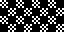
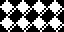
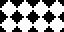
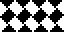
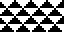
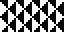
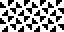
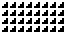
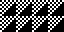

# 07 – Checked

Check patterns.

## Gallery

| Pattern | Preview | Bitmap | Arduboy | Bitsy | PICO-8 | Thumby |
| :--- | :---: | :---: | :---: | :---: | :---: | :---: |
| CheckMicro p|  | [png](png/CheckMicro.png) | [cpp](Checked.h#L12-L24) | [txt](Checked.bitsy.txt#L5-L14) | [p𝟪](checked.p8.lua#L7-L20) | [py](Checked.thumby.py#L5-L16) |
| CheckMini o|  | [png](png/CheckMini.png) | [cpp](Checked.h#L26-L38) | [txt](Checked.bitsy.txt#L16-L25) | [p𝟪](checked.p8.lua#L22-L35) | [py](Checked.thumby.py#L18-L29) |
| Check o|  | [png](png/Check.png) | [cpp](Checked.h#L40-L51) | [txt](Checked.bitsy.txt#L27-L36) | [p𝟪](checked.p8.lua#L37-L49) | [py](Checked.thumby.py#L31-L42) |
| CheckShaded |  | [png](png/CheckShaded.png) | [cpp](Checked.h#L53-L64) | [txt](Checked.bitsy.txt#L38-L47) | [p𝟪](checked.p8.lua#L51-L63) | [py](Checked.thumby.py#L44-L55) |
| CheckBox |  | [png](png/CheckBox.png) | [cpp](Checked.h#L66-L77) | [txt](Checked.bitsy.txt#L49-L58) | [p𝟪](checked.p8.lua#L65-L77) | [py](Checked.thumby.py#L57-L68) |
| CheckSquare |  | [png](png/CheckSquare.png) | [cpp](Checked.h#L79-L90) | [txt](Checked.bitsy.txt#L60-L69) | [p𝟪](checked.p8.lua#L79-L91) | [py](Checked.thumby.py#L70-L81) |
| CheckHorizontalMini |  | [png](png/CheckHorizontalMini.png) | [cpp](Checked.h#L92-L104) | [txt](Checked.bitsy.txt#L71-L80) | [p𝟪](checked.p8.lua#L93-L106) | [py](Checked.thumby.py#L83-L94) |
| CheckHorizontal |  | [png](png/CheckHorizontal.png) | [cpp](Checked.h#L106-L117) | [txt](Checked.bitsy.txt#L82-L91) | [p𝟪](checked.p8.lua#L108-L120) | [py](Checked.thumby.py#L96-L107) |
| CheckVerticalMini |  | [png](png/CheckVerticalMini.png) | [cpp](Checked.h#L119-L131) | [txt](Checked.bitsy.txt#L93-L102) | [p𝟪](checked.p8.lua#L122-L135) | [py](Checked.thumby.py#L109-L120) |
| CheckVertical |  | [png](png/CheckVertical.png) | [cpp](Checked.h#L133-L144) | [txt](Checked.bitsy.txt#L104-L113) | [p𝟪](checked.p8.lua#L137-L149) | [py](Checked.thumby.py#L122-L133) |
| Diamond o|  | [png](png/Diamond.png) | [cpp](Checked.h#L146-L157) | [txt](Checked.bitsy.txt#L115-L124) | [p𝟪](checked.p8.lua#L151-L163) | [py](Checked.thumby.py#L135-L146) |
| DiamondShaded |  | [png](png/DiamondShaded.png) | [cpp](Checked.h#L159-L170) | [txt](Checked.bitsy.txt#L126-L135) | [p𝟪](checked.p8.lua#L165-L177) | [py](Checked.thumby.py#L148-L159) |
| DiamondLined |  | [png](png/DiamondLined.png) | [cpp](Checked.h#L172-L183) | [txt](Checked.bitsy.txt#L137-L146) | [p𝟪](checked.p8.lua#L179-L191) | [py](Checked.thumby.py#L161-L172) |
| DiamondBold |  | [png](png/DiamondBold.png) | [cpp](Checked.h#L185-L196) | [txt](Checked.bitsy.txt#L148-L157) | [p𝟪](checked.p8.lua#L193-L205) | [py](Checked.thumby.py#L174-L185) |
| CheckDiagonalMini |  | [png](png/CheckDiagonalMini.png) | [cpp](Checked.h#L198-L210) | [txt](Checked.bitsy.txt#L159-L168) | [p𝟪](checked.p8.lua#L207-L220) | [py](Checked.thumby.py#L187-L198) |
| CheckDiagonal |  | [png](png/CheckDiagonal.png) | [cpp](Checked.h#L212-L223) | [txt](Checked.bitsy.txt#L170-L179) | [p𝟪](checked.p8.lua#L222-L234) | [py](Checked.thumby.py#L200-L211) |
| CheckDiagonalShaded |  | [png](png/CheckDiagonalShaded.png) | [cpp](Checked.h#L225-L236) | [txt](Checked.bitsy.txt#L181-L190) | [p𝟪](checked.p8.lua#L236-L248) | [py](Checked.thumby.py#L213-L224) |
| TernaryMini |  | [png](png/TernaryMini.png) | [cpp](Checked.h#L238-L250) | [txt](Checked.bitsy.txt#L192-L201) | [p𝟪](checked.p8.lua#L250-L263) | [py](Checked.thumby.py#L226-L237) |
| Ternary |  | [png](png/Ternary.png) | [cpp](Checked.h#L252-L263) | [txt](Checked.bitsy.txt#L203-L212) | [p𝟪](checked.p8.lua#L265-L277) | [py](Checked.thumby.py#L239-L250) |
| TernaryVerticalMini |  | [png](png/TernaryVerticalMini.png) | [cpp](Checked.h#L265-L277) | [txt](Checked.bitsy.txt#L214-L223) | [p𝟪](checked.p8.lua#L279-L292) | [py](Checked.thumby.py#L252-L263) |
| TernaryVertical |  | [png](png/TernaryVertical.png) | [cpp](Checked.h#L279-L290) | [txt](Checked.bitsy.txt#L225-L234) | [p𝟪](checked.p8.lua#L294-L306) | [py](Checked.thumby.py#L265-L276) |
| Gyron |  | [png](png/Gyron.png) | [cpp](Checked.h#L292-L303) | [txt](Checked.bitsy.txt#L236-L245) | [p𝟪](checked.p8.lua#L308-L320) | [py](Checked.thumby.py#L278-L289) |
| TriangleMini |  | [png](png/TriangleMini.png) | [cpp](Checked.h#L305-L317) | [txt](Checked.bitsy.txt#L247-L256) | [p𝟪](checked.p8.lua#L322-L335) | [py](Checked.thumby.py#L291-L302) |
| Triangle |  | [png](png/Triangle.png) | [cpp](Checked.h#L319-L330) | [txt](Checked.bitsy.txt#L258-L267) | [p𝟪](checked.p8.lua#L337-L349) | [py](Checked.thumby.py#L304-L315) |
| TriangleShaded |  | [png](png/TriangleShaded.png) | [cpp](Checked.h#L332-L343) | [txt](Checked.bitsy.txt#L269-L278) | [p𝟪](checked.p8.lua#L351-L363) | [py](Checked.thumby.py#L317-L328) |
| ChevronCheckMini |  | [png](png/ChevronCheckMini.png) | [cpp](Checked.h#L345-L357) | [txt](Checked.bitsy.txt#L280-L289) | [p𝟪](checked.p8.lua#L365-L378) | [py](Checked.thumby.py#L330-L341) |
| ChevronCheckDense |  | [png](png/ChevronCheckDense.png) | [cpp](Checked.h#L359-L370) | [txt](Checked.bitsy.txt#L291-L300) | [p𝟪](checked.p8.lua#L380-L392) | [py](Checked.thumby.py#L343-L354) |
| ChevronCheck |  | [png](png/ChevronCheck.png) | [cpp](Checked.h#L372-L383) | [txt](Checked.bitsy.txt#L302-L311) | [p𝟪](checked.p8.lua#L394-L406) | [py](Checked.thumby.py#L356-L367) |

[`⤴`](#gallery)

---

o: Pattern included in the `Office` collection  
p: Pattern included in the `PICO-8` collection 

 
