# 08 – Rectilinear

Rectilinear patterns.

## Gallery

| Pattern | Preview | Bitmap | Arduboy | Bitsy | PICO-8 | Thumby | UDG |
| :------ | :-----: | :----: | :-----: | :---: | :----: | :----: | :-: |
| SquareMicro p|  | [png](png/SquareMicro.png) | [cpp](Rectilinear.h#L12-L24) | [txt](Rectilinear.bitsy.txt#L5-L14) | [p𝟪](rectilinear.p8.lua#L7-L20) | [py](Rectilinear.thumby.py#L5-L16) |
| SquareMicroOffset | 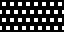 | [png](png/SquareMicroOffset.png) | | | | | |
| SquareMiniHighlight | 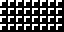 | [png](png/SquareMiniHighlight.png) | | | | | |
| SquareMini | 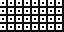 | [png](png/SquareMini.png) | | | | | |
| SquareMiniOffset | 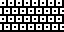 | [png](png/SquareMiniOffset.png) | | | | | |
| SquareMiniSolid | 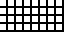 | [png](png/SquareMiniSolid.png) | | | | | |
| SquareMiniOffsetSolid | 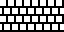 | [png](png/SquareMiniOffsetSolid.png) | | | | | |
| BilletMiniHighlight | 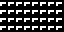 | [png](png/BilletMiniHighlight.png) | | | | | |
| BilletMini |  | [png](png/BilletMini.png) | | | | | |
| BilletMiniVertical p| 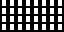 | [png](png/BilletMiniVertical.png) | [cpp](Rectilinear.h#L26-L38) | [txt](Rectilinear.bitsy.txt#L16-L25) | [p𝟪](rectilinear.p8.lua#L22-L35) | [py](Rectilinear.thumby.py#L18-L29) |

 

| Pattern | Preview | Bitmap | Arduboy | Bitsy | PICO-8 | Thumby | UDG |
| :------ | :-----: | :----: | :-----: | :---: | :----: | :----: | :-: |
| Square | 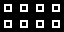 | [png](png/Square.png) | [cpp](Rectilinear.h#L40-L51) | [txt](Rectilinear.bitsy.txt#L27-L36) | [p𝟪](rectilinear.p8.lua#L37-L49) | [py](Rectilinear.thumby.py#L31-L42) |
| SquareSolid |  | [png](png/SquareSolid.png) | | | | | |
| SquareShaded | 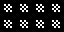 | [png](png/SquareShaded.png) | | | | | |
| SquareLarge|  | [png](png/SquareLarge.png) | | | | | |
| SquareLargeMedium | 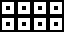 | [png](png/SquareLargeMedium.png) | [cpp](Rectilinear.h#L53-L64) | [txt](Rectilinear.bitsy.txt#L38-L47) | [p𝟪](rectilinear.p8.lua#L51-L63) | [py](Rectilinear.thumby.py#L44-L55) |
| SquareLargeSolid |  | [png](png/SquareLargeSolid.png) | | | | | |
| SquareLargeShaded| 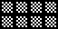 | [png](png/SquareLargeShaded.png) | | | | | |
| SquareXL| 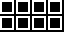 | [png](png/SquareXL.png) | | | | | |
| SquareXLMedium| 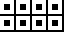 | [png](png/SquareXLMedium.png) | | | | | |
| SquareXLSolid| 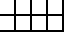 | [png](png/SquareXLSolid.png) | | | | | |
| SquareXLShaded| 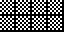 | [png](png/SquareXLShaded.png) | | | | | |

 

| Pattern | Preview | Bitmap | Arduboy | Bitsy | PICO-8 | Thumby | UDG |
| :------ | :-----: | :----: | :-----: | :---: | :----: | :----: | :-: |
| Rectangle | 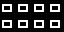 | [png](png/Rectangle.png) | | | | | |
| RectangleSolid |  | [png](png/RectangleSolid.png) | | | | | |
| RectangleLarge | 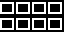 | [png](png/RectangleLarge.png) | | | | | |
| RectangleLargeMedium | 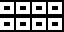 | [png](png/RectangleLargeMedium.png) | | | | | |
| RectangleLargeSolid | 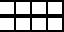 | [png](png/RectangleLargeSolid.png) | | | | | |
| Billet | 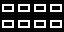 | [png](png/Billet.png) | | | | | |
| BilletSolid |  | [png](png/BilletSolid.png) | | | | | |
| BilletShaded | 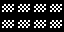 | [png](png/BilletShaded.png) | | | | | |
| BilletVertical |  | [png](png/BilletVertical.png) | | | | | |
| BilletVerticalSolid |  | [png](png/BilletVerticalSolid.png) | | | | | |
| BilletVerticalShaded | 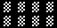 | [png](png/BilletVerticalShaded.png) | | | | | |

 

| Pattern | Preview | Bitmap | Arduboy | Bitsy | PICO-8 | Thumby | UDG |
| :------ | :-----: | :----: | :-----: | :---: | :----: | :----: | :-: |
| Waffle |  | [png](png/Waffle.png) | [cpp](Rectilinear.h#L66-L77) | [txt](Rectilinear.bitsy.txt#L49-L58) | [p𝟪](rectilinear.p8.lua#L65-L77) | [py](Rectilinear.thumby.py#L57-L68) |
| Tile |  | [png](png/Tile.png) | [cpp](Rectilinear.h#L79-L90) | [txt](Rectilinear.bitsy.txt#L60-L69) | [p𝟪](rectilinear.p8.lua#L79-L91) | [py](Rectilinear.thumby.py#L70-L81) |
| TileShaded |  | [png](png/TileShaded.png) | [cpp](Rectilinear.h#L92-L103) | [txt](Rectilinear.bitsy.txt#L71-L80) | [p𝟪](rectilinear.p8.lua#L93-L105) | [py](Rectilinear.thumby.py#L83-L94) |
| Illuminated |  | [png](png/Illuminated.png) | [cpp](Rectilinear.h#L105-L116) | [txt](Rectilinear.bitsy.txt#L82-L91) | [p𝟪](rectilinear.p8.lua#L107-L119) | [py](Rectilinear.thumby.py#L96-L107) |
| Block |  | [png](png/Block.png) | [cpp](Rectilinear.h#L118-L129) | [txt](Rectilinear.bitsy.txt#L93-L102) | [p𝟪](rectilinear.p8.lua#L121-L133) | [py](Rectilinear.thumby.py#L109-L120) |
| BlockPyramid |  | [png](png/BlockPyramid.png) | [cpp](Rectilinear.h#L131-L142) | [txt](Rectilinear.bitsy.txt#L104-L113) | [p𝟪](rectilinear.p8.lua#L135-L147) | [py](Rectilinear.thumby.py#L122-L133) |

[`⤴`](#gallery)

---

o: Pattern included in the `Office` collection  
p: Pattern included in the `PICO-8` collection

 
