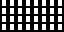

# 08 – Rectilinear

Rectilinear patterns.

## Gallery

| Pattern | Preview | Bitmap | Arduboy | Bitsy | PICO-8 | Playdate | Thumby |
| :------ | :-----: | :----: | :-----: | :---: | :----: | :------: | :----: |
| SquareMicro p|  | [png](png/SquareMicro.png) | [cpp](Rectilinear.h#L12-L24) | [txt](Rectilinear.bitsy.txt#L5-L14) | [p𝟪](rectilinear.p8.lua#L7-L20) | [lua](Rectilinear.playdate.lua#L5-L17) | [py](Rectilinear.thumby.py#L5-L16) |
| SquareMicroOffset |  | [png](png/SquareMicroOffset.png) | [cpp](Rectilinear.h#L26-L37) | [txt](Rectilinear.bitsy.txt#L16-L25) | [p𝟪](rectilinear.p8.lua#L22-L34) | [lua](Rectilinear.playdate.lua#L19-L31) | [py](Rectilinear.thumby.py#L18-L29) |
| SquareMiniHighlight |  | [png](png/SquareMiniHighlight.png) | [cpp](Rectilinear.h#L39-L51) | [txt](Rectilinear.bitsy.txt#L27-L36) | [p𝟪](rectilinear.p8.lua#L36-L49) | [lua](Rectilinear.playdate.lua#L33-L45) | [py](Rectilinear.thumby.py#L31-L42) |
| SquareMini |  | [png](png/SquareMini.png) | [cpp](Rectilinear.h#L53-L65) | [txt](Rectilinear.bitsy.txt#L38-L47) | [p𝟪](rectilinear.p8.lua#L51-L64) | [lua](Rectilinear.playdate.lua#L47-L59) | [py](Rectilinear.thumby.py#L44-L55) |
| SquareMiniOffset |  | [png](png/SquareMiniOffset.png) | [cpp](Rectilinear.h#L67-L78) | [txt](Rectilinear.bitsy.txt#L49-L58) | [p𝟪](rectilinear.p8.lua#L66-L78) | [lua](Rectilinear.playdate.lua#L61-L73) | [py](Rectilinear.thumby.py#L57-L68) |
| SquareMiniSolid |  | [png](png/SquareMiniSolid.png) | [cpp](Rectilinear.h#L80-L92) | [txt](Rectilinear.bitsy.txt#L60-L69) | [p𝟪](rectilinear.p8.lua#L80-L93) | [lua](Rectilinear.playdate.lua#L75-L87) | [py](Rectilinear.thumby.py#L70-L81) |
| SquareMiniSolidOffset |  | [png](png/SquareMiniSolidOffset.png) | [cpp](Rectilinear.h#L94-L105) | [txt](Rectilinear.bitsy.txt#L71-L80) | [p𝟪](rectilinear.p8.lua#L95-L107) | [lua](Rectilinear.playdate.lua#L89-L101) | [py](Rectilinear.thumby.py#L83-L94) |
| BilletMiniHighlight |  | [png](png/BilletMiniHighlight.png) | [cpp](Rectilinear.h#L107-L119) | [txt](Rectilinear.bitsy.txt#L82-L91) | [p𝟪](rectilinear.p8.lua#L109-L122) | [lua](Rectilinear.playdate.lua#L103-L115) | [py](Rectilinear.thumby.py#L96-L107) |
| BilletMini |  | [png](png/BilletMini.png) | [cpp](Rectilinear.h#L121-L133) | [txt](Rectilinear.bitsy.txt#L93-L102) | [p𝟪](rectilinear.p8.lua#L124-L137) | [lua](Rectilinear.playdate.lua#L117-L129) | [py](Rectilinear.thumby.py#L109-L120) |
| BilletVerticalMini p|  | [png](png/BilletVerticalMini.png) | [cpp](Rectilinear.h#L135-L147) | [txt](Rectilinear.bitsy.txt#L104-L113) | [p𝟪](rectilinear.p8.lua#L139-L152) | [lua](Rectilinear.playdate.lua#L131-L143) | [py](Rectilinear.thumby.py#L122-L133) |

 

| Pattern | Preview | Bitmap | Arduboy | Bitsy | PICO-8 | Playdate | Thumby |
| :------ | :-----: | :----: | :-----: | :---: | :----: | :------: | :----: |
| Square |  | [png](png/Square.png) | [cpp](Rectilinear.h#L149-L160) | [txt](Rectilinear.bitsy.txt#L115-L124) | [p𝟪](rectilinear.p8.lua#L154-L166) | [lua](Rectilinear.playdate.lua#L145-L157) | [py](Rectilinear.thumby.py#L135-L146) |
| SquareSolid |  | [png](png/SquareSolid.png) | [cpp](Rectilinear.h#L162-L173) | [txt](Rectilinear.bitsy.txt#L126-L135) | [p𝟪](rectilinear.p8.lua#L168-L180) | [lua](Rectilinear.playdate.lua#L159-L171) | [py](Rectilinear.thumby.py#L148-L159) |
| SquareShaded |  | [png](png/SquareShaded.png) | [cpp](Rectilinear.h#L175-L186) | [txt](Rectilinear.bitsy.txt#L137-L146) | [p𝟪](rectilinear.p8.lua#L182-L194) | [lua](Rectilinear.playdate.lua#L173-L185) | [py](Rectilinear.thumby.py#L161-L172) |
| SquareLarge |  | [png](png/SquareLarge.png) | [cpp](Rectilinear.h#L188-L199) | [txt](Rectilinear.bitsy.txt#L148-L157) | [p𝟪](rectilinear.p8.lua#L196-L208) | [lua](Rectilinear.playdate.lua#L187-L199) | [py](Rectilinear.thumby.py#L174-L185) |
| SquareLargeMedium |  | [png](png/SquareLargeMedium.png) | [cpp](Rectilinear.h#L201-L212) | [txt](Rectilinear.bitsy.txt#L159-L168) | [p𝟪](rectilinear.p8.lua#L210-L222) | [lua](Rectilinear.playdate.lua#L201-L213) | [py](Rectilinear.thumby.py#L187-L198) |
| SquareLargeSolid |  | [png](png/SquareLargeSolid.png) | [cpp](Rectilinear.h#L214-L225) | [txt](Rectilinear.bitsy.txt#L170-L179) | [p𝟪](rectilinear.p8.lua#L224-L236) | [lua](Rectilinear.playdate.lua#L215-L227) | [py](Rectilinear.thumby.py#L200-L211) |
| SquareLargeShaded |  | [png](png/SquareLargeShaded.png) | [cpp](Rectilinear.h#L227-L238) | [txt](Rectilinear.bitsy.txt#L181-L190) | [p𝟪](rectilinear.p8.lua#L238-L250) | [lua](Rectilinear.playdate.lua#L229-L241) | [py](Rectilinear.thumby.py#L213-L224) |
| SquareXL |  | [png](png/SquareXL.png) | [cpp](Rectilinear.h#L240-L251) | [txt](Rectilinear.bitsy.txt#L192-L201) | [p𝟪](rectilinear.p8.lua#L252-L264) | [lua](Rectilinear.playdate.lua#L243-L255) | [py](Rectilinear.thumby.py#L226-L237) |
| SquareXLMedium |  | [png](png/SquareXLMedium.png) | [cpp](Rectilinear.h#L253-L264) | [txt](Rectilinear.bitsy.txt#L203-L212) | [p𝟪](rectilinear.p8.lua#L266-L278) | [lua](Rectilinear.playdate.lua#L257-L269) | [py](Rectilinear.thumby.py#L239-L250) |
| SquareXLSolid |  | [png](png/SquareXLSolid.png) | [cpp](Rectilinear.h#L266-L277) | [txt](Rectilinear.bitsy.txt#L214-L223) | [p𝟪](rectilinear.p8.lua#L280-L292) | [lua](Rectilinear.playdate.lua#L271-L283) | [py](Rectilinear.thumby.py#L252-L263) |
| SquareXLShaded |  | [png](png/SquareXLShaded.png) | [cpp](Rectilinear.h#L279-L290) | [txt](Rectilinear.bitsy.txt#L225-L234) | [p𝟪](rectilinear.p8.lua#L294-L306) | [lua](Rectilinear.playdate.lua#L285-L297) | [py](Rectilinear.thumby.py#L265-L276) |

 

| Pattern | Preview | Bitmap | Arduboy | Bitsy | PICO-8 | Playdate | Thumby |
| :------ | :-----: | :----: | :-----: | :---: | :----: | :------: | :----: |
| Rectangle |  | [png](png/Rectangle.png) | [cpp](Rectilinear.h#L292-L303) | [txt](Rectilinear.bitsy.txt#L236-L245) | [p𝟪](rectilinear.p8.lua#L308-L320) | [lua](Rectilinear.playdate.lua#L299-L311) | [py](Rectilinear.thumby.py#L278-L289) |
| RectangleSolid |  | [png](png/RectangleSolid.png) | [cpp](Rectilinear.h#L305-L316) | [txt](Rectilinear.bitsy.txt#L247-L256) | [p𝟪](rectilinear.p8.lua#L322-L334) | [lua](Rectilinear.playdate.lua#L313-L325) | [py](Rectilinear.thumby.py#L291-L302) |
| RectangleLarge |  | [png](png/RectangleLarge.png) | [cpp](Rectilinear.h#L318-L329) | [txt](Rectilinear.bitsy.txt#L258-L267) | [p𝟪](rectilinear.p8.lua#L336-L348) | [lua](Rectilinear.playdate.lua#L327-L339) | [py](Rectilinear.thumby.py#L304-L315) |
| RectangleLargeMedium |  | [png](png/RectangleLargeMedium.png) | [cpp](Rectilinear.h#L331-L342) | [txt](Rectilinear.bitsy.txt#L269-L278) | [p𝟪](rectilinear.p8.lua#L350-L362) | [lua](Rectilinear.playdate.lua#L341-L353) | [py](Rectilinear.thumby.py#L317-L328) |
| RectangleLargeSolid |  | [png](png/RectangleLargeSolid.png) | [cpp](Rectilinear.h#L344-L355) | [txt](Rectilinear.bitsy.txt#L280-L289) | [p𝟪](rectilinear.p8.lua#L364-L376) | [lua](Rectilinear.playdate.lua#L355-L367) | [py](Rectilinear.thumby.py#L330-L341) |
| Billet |  | [png](png/Billet.png) | [cpp](Rectilinear.h#L357-L368) | [txt](Rectilinear.bitsy.txt#L291-L300) | [p𝟪](rectilinear.p8.lua#L378-L390) | [lua](Rectilinear.playdate.lua#L369-L381) | [py](Rectilinear.thumby.py#L343-L354) |
| BilletSolid |  | [png](png/BilletSolid.png) | [cpp](Rectilinear.h#L370-L381) | [txt](Rectilinear.bitsy.txt#L302-L311) | [p𝟪](rectilinear.p8.lua#L392-L404) | [lua](Rectilinear.playdate.lua#L383-L395) | [py](Rectilinear.thumby.py#L356-L367) |
| BilletShaded |  | [png](png/BilletShaded.png) | [cpp](Rectilinear.h#L383-L394) | [txt](Rectilinear.bitsy.txt#L313-L322) | [p𝟪](rectilinear.p8.lua#L406-L418) | [lua](Rectilinear.playdate.lua#L397-L409) | [py](Rectilinear.thumby.py#L369-L380) |
| BilletVertical |  | [png](png/BilletVertical.png) | [cpp](Rectilinear.h#L396-L407) | [txt](Rectilinear.bitsy.txt#L324-L333) | [p𝟪](rectilinear.p8.lua#L420-L432) | [lua](Rectilinear.playdate.lua#L411-L423) | [py](Rectilinear.thumby.py#L382-L393) |
| BilletVerticalSolid |  | [png](png/BilletVerticalSolid.png) | [cpp](Rectilinear.h#L409-L420) | [txt](Rectilinear.bitsy.txt#L335-L344) | [p𝟪](rectilinear.p8.lua#L434-L446) | [lua](Rectilinear.playdate.lua#L425-L437) | [py](Rectilinear.thumby.py#L395-L406) |
| BilletVerticalShaded |  | [png](png/BilletVerticalShaded.png) | [cpp](Rectilinear.h#L422-L433) | [txt](Rectilinear.bitsy.txt#L346-L355) | [p𝟪](rectilinear.p8.lua#L448-L460) | [lua](Rectilinear.playdate.lua#L439-L451) | [py](Rectilinear.thumby.py#L408-L419) |

 

| Pattern | Preview | Bitmap | Arduboy | Bitsy | PICO-8 | Playdate | Thumby |
| :------ | :-----: | :----: | :-----: | :---: | :----: | :------: | :----: |
| Waffle |  | [png](png/Waffle.png) | [cpp](Rectilinear.h#L435-L446) | [txt](Rectilinear.bitsy.txt#L357-L366) | [p𝟪](rectilinear.p8.lua#L462-L474) | [lua](Rectilinear.playdate.lua#L453-L465) | [py](Rectilinear.thumby.py#L421-L432) |
| Tile |  | [png](png/Tile.png) | [cpp](Rectilinear.h#L448-L459) | [txt](Rectilinear.bitsy.txt#L368-L377) | [p𝟪](rectilinear.p8.lua#L476-L488) | [lua](Rectilinear.playdate.lua#L467-L479) | [py](Rectilinear.thumby.py#L434-L445) |
| TileShaded |  | [png](png/TileShaded.png) | [cpp](Rectilinear.h#L461-L472) | [txt](Rectilinear.bitsy.txt#L379-L388) | [p𝟪](rectilinear.p8.lua#L490-L502) | [lua](Rectilinear.playdate.lua#L481-L493) | [py](Rectilinear.thumby.py#L447-L458) |
| Illuminated |  | [png](png/Illuminated.png) | [cpp](Rectilinear.h#L474-L485) | [txt](Rectilinear.bitsy.txt#L390-L399) | [p𝟪](rectilinear.p8.lua#L504-L516) | [lua](Rectilinear.playdate.lua#L495-L507) | [py](Rectilinear.thumby.py#L460-L471) |
| Block |  | [png](png/Block.png) | [cpp](Rectilinear.h#L487-L498) | [txt](Rectilinear.bitsy.txt#L401-L410) | [p𝟪](rectilinear.p8.lua#L518-L530) | [lua](Rectilinear.playdate.lua#L509-L521) | [py](Rectilinear.thumby.py#L473-L484) |
| BlockPyramid |  | [png](png/BlockPyramid.png) | [cpp](Rectilinear.h#L500-L511) | [txt](Rectilinear.bitsy.txt#L412-L421) | [p𝟪](rectilinear.p8.lua#L532-L544) | [lua](Rectilinear.playdate.lua#L523-L535) | [py](Rectilinear.thumby.py#L486-L497) |

[`⤴`](#gallery)

---

o: Pattern included in the `Office` collection  
p: Pattern included in the `PICO-8` collection

 
