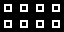
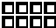
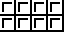
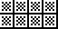
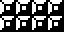
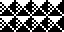

# 08 – Rectilinear

Rectilinear patterns.

## Gallery

| Pattern | Preview | Bitmap | Arduboy | Bitsy | PICO-8 | Thumby |
| :--- | :---: | :---: | :---: | :---: | :---: | :---: |
| SquareMini p|  | [png](png/SquareMini.png) | cpp | txt | lua | py |
| BilletMini p|  | [png](png/BilletMini.png) | cpp | txt | lua | py |
| Box |  | [png](png/Box.png) | cpp | txt | lua | py |
| BoxMedium |  | [png](png/BoxMedium.png) | cpp | txt | lua | py |
| Waffle |  | [png](png/Waffle.png) | cpp | txt | lua | py |
| Tile |  | [png](png/Tile.png) | cpp | txt | lua | py
| TileShaded |  | [png](png/TileShaded.png) | cpp | txt | lua | py
| Illuminated |  | [png](png/Illuminated.png) | cpp | txt | lua | py |
| Block |  | [png](png/Block.png) | cpp | txt | lua | py
| BlockPyramid |  | [png](png/BlockPyramid.png) | cpp | txt | lua | py

[`⤴`](#gallery)

---

o: Pattern included in the `Office` collection  
p: Pattern included in the `PICO-8` collection 

 
