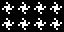
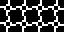
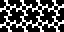
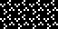
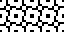

# 09 – Radial

Radial patterns.

## Gallery

| Pattern | Preview | Bitmap | Arduboy | Bitsy | PICO-8 | Thumby |
| :--- | :---: | :---: | :---: | :---: | :---: | :---: |
| Nebula |  | [png](png/Nebula.png) | [cpp](Radial.h#L12-L23) | [txt](Radial.bitsy.txt#L5-L14) | [lua](radial.p8.lua#L7-L19) | [py](Radial.thumby.py#L5-L16) |
| Pinwheel |  | [png](png/Pinwheel.png) | [cpp](Radial.h#L25-L36) | [txt](Radial.bitsy.txt#L16-L25) | [lua](radial.p8.lua#L21-L33) | [py](Radial.thumby.py#L18-L29) |
| Pivot |  | [png](png/Pivot.png) | [cpp](Radial.h#L38-L49) | [txt](Radial.bitsy.txt#L27-L36) | [lua](radial.p8.lua#L35-L47) | [py](Radial.thumby.py#L31-L42) |
| Fylfot |  | [png](png/Fylfot.png) | [cpp](Radial.h#L51-L62) | [txt](Radial.bitsy.txt#L38-L47) | [lua](radial.p8.lua#L49-L61) | [py](Radial.thumby.py#L44-L55) |
| Rotary |  | [png](png/Rotary.png) | [cpp](Radial.h#L64-L75) | [txt](Radial.bitsy.txt#L49-L58) | [lua](radial.p8.lua#L63-L75) | [py](Radial.thumby.py#L57-L68) |
| StarBurst |  | [png](png/StarBurst.png) | [cpp](Radial.h#L77-L88) | [txt](Radial.bitsy.txt#L60-L69) | [lua](radial.p8.lua#L77-L89) | [py](Radial.thumby.py#L70-L81) |
| Swirl |  | [png](png/Swirl.png) | [cpp](Radial.h#L90-L101) | [txt](Radial.bitsy.txt#L71-L80) | [lua](radial.p8.lua#L91-L103) | [py](Radial.thumby.py#L83-L94) |
| Swarm |  | [png](png/Swarm.png) | [cpp](Radial.h#L103-L114) | [txt](Radial.bitsy.txt#L82-L91) | [lua](radial.p8.lua#L105-L117) | [py](Radial.thumby.py#L96-L107) |
| Encircled |  | [png](png/Encircled.png) | [cpp](Radial.h#L116-L127) | [txt](Radial.bitsy.txt#L93-L102) | [lua](radial.p8.lua#L119-L131) | [py](Radial.thumby.py#L109-L120) |
| Spokes |  | [png](png/Spokes.png) | [cpp](Radial.h#L129-L140) | [txt](Radial.bitsy.txt#L104-L113) | [lua](radial.p8.lua#L133-L145) | [py](Radial.thumby.py#L122-L133) |
| Cartwheel |  | [png](png/Cartwheel.png) | [cpp](Radial.h#L142-L153) | [txt](Radial.bitsy.txt#L115-L124) | [lua](radial.p8.lua#L147-L159) | [py](Radial.thumby.py#L135-L146) |
| CartwheelBold |  | [png](png/CartwheelBold.png) | [cpp](Radial.h#L155-L166) | [txt](Radial.bitsy.txt#L126-L135) | [lua](radial.p8.lua#L161-L173) | [py](Radial.thumby.py#L148-L159) |
| CartwheelExtraBold |  | [png](png/CartwheelExtraBold.png) | [cpp](Radial.h#L168-L179) | [txt](Radial.bitsy.txt#L137-L146) | [lua](radial.p8.lua#L175-L187) | [py](Radial.thumby.py#L161-L172) |

[`⤴`](#gallery)

---

o: Pattern included in the `Office` collection  
p: Pattern included in the `PICO-8` collection 

 
