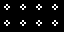
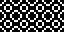
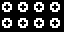
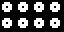
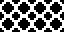

# 10 – Round

Round patterns.

## Gallery

| Pattern | Preview | Bitmap | Arduboy | Bitsy | PICO-8 | Thumby |
| :--- | :---: | :---: | :---: | :---: | :---: | :---: |
| AnnuletSmall |  | [png](png/AnnuletSmall.png) | [cpp](Round.h#L12-L23) | [txt](Round.bitsy.txt#L5-L14) | [p𝟪](round.p8.lua#L7-L19) | [py](Round.thumby.py#L5-L16) |
| AnnuletSmallDuo |  | [png](png/AnnuletSmallDuo.png) | [cpp](Round.h#L25-L36) | [txt](Round.bitsy.txt#L16-L25) | [p𝟪](round.p8.lua#L21-L33) | [py](Round.thumby.py#L18-L29) |
| AnnuletSmallQuad p|  | [png](png/AnnuletSmallQuad.png) | [cpp](Round.h#L38-L50) | [txt](Round.bitsy.txt#L27-L36) | [p𝟪](round.p8.lua#L35-L48) | [py](Round.thumby.py#L31-L42) |
| RoundelSmallDuo |  | [png](png/RoundelSmallDuo.png) | [cpp](Round.h#L52-L63) | [txt](Round.bitsy.txt#L38-L47) | [p𝟪](round.p8.lua#L50-L62) | [py](Round.thumby.py#L44-L55) |
| RoundelSmall |  | [png](png/RoundelSmall.png) | [cpp](Round.h#L65-L76) | [txt](Round.bitsy.txt#L49-L58) | [p𝟪](round.p8.lua#L64-L76) | [py](Round.thumby.py#L57-L68) |
| Annulet |  | [png](png/Annulet.png) | [cpp](Round.h#L78-L89) | [txt](Round.bitsy.txt#L60-L69) | [p𝟪](round.p8.lua#L78-L90) | [py](Round.thumby.py#L70-L81) |
| AnnuletCoAnnulet |  | [png](png/AnnuletCoAnnulet.png) | [cpp](Round.h#L91-L102) | [txt](Round.bitsy.txt#L71-L80) | [p𝟪](round.p8.lua#L92-L104) | [py](Round.thumby.py#L83-L94) |
| AnnuletCoAnnuletSquare |  | [png](png/AnnuletCoAnnuletSquare.png) | [cpp](Round.h#L104-L115) | [txt](Round.bitsy.txt#L82-L91) | [p𝟪](round.p8.lua#L106-L118) | [py](Round.thumby.py#L96-L107) |
| AnnuletCoAnnuletXL |  | [png](png/AnnuletCoAnnuletXL.png) | [cpp](Round.h#L117-L128) | [txt](Round.bitsy.txt#L93-L102) | [p𝟪](round.p8.lua#L120-L132) | [py](Round.thumby.py#L109-L120) |
| RoundelCoAnnuletXL |  | [png](png/RoundelCoAnnuletXL.png) | [cpp](Round.h#L130-L141) | [txt](Round.bitsy.txt#L104-L113) | [p𝟪](round.p8.lua#L134-L146) | [py](Round.thumby.py#L122-L133) |
| RoundelCoAnnulet |  | [png](png/RoundelCoAnnulet.png) | [cpp](Round.h#L143-L154) | [txt](Round.bitsy.txt#L115-L124) | [p𝟪](round.p8.lua#L148-L160) | [py](Round.thumby.py#L135-L146) |
| RoundelCoRoundel |  | [png](png/RoundelCoRoundel.png) | [cpp](Round.h#L156-L167) | [txt](Round.bitsy.txt#L126-L135) | [p𝟪](round.p8.lua#L162-L174) | [py](Round.thumby.py#L148-L159) |
| Roundel |  | [png](png/Roundel.png) | [cpp](Round.h#L169-L180) | [txt](Round.bitsy.txt#L137-L146) | [p𝟪](round.p8.lua#L176-L188) | [py](Round.thumby.py#L161-L172) |
| Ball |  | [png](png/Ball.png) | [cpp](Round.h#L182-L193) | [txt](Round.bitsy.txt#L148-L157) | [p𝟪](round.p8.lua#L190-L202) | [py](Round.thumby.py#L174-L185) |
| AnnuletLarge |  | [png](png/AnnuletLarge.png) | [cpp](Round.h#L195-L206) | [txt](Round.bitsy.txt#L159-L168) | [p𝟪](round.p8.lua#L204-L216) | [py](Round.thumby.py#L187-L198) |
| AnnuletLargeMedium |  | [png](png/AnnuletLargeMedium.png) | [cpp](Round.h#L208-L219) | [txt](Round.bitsy.txt#L170-L179) | [p𝟪](round.p8.lua#L218-L230) | [py](Round.thumby.py#L200-L211) |
| AnnuletLargeBold |  | [png](png/AnnuletLargeBold.png) | [cpp](Round.h#L221-L232) | [txt](Round.bitsy.txt#L181-L190) | [p𝟪](round.p8.lua#L232-L244) | [py](Round.thumby.py#L213-L224) |
| RoundelLarge |  | [png](png/RoundelLarge.png) | [cpp](Round.h#L234-L245) | [txt](Round.bitsy.txt#L192-L201) | [p𝟪](round.p8.lua#L246-L258) | [py](Round.thumby.py#L226-L237) |
| BallLarge |  | [png](png/BallLarge.png) | [cpp](Round.h#L247-L258) | [txt](Round.bitsy.txt#L203-L212) | [p𝟪](round.p8.lua#L260-L272) | [py](Round.thumby.py#L239-L250) |
| Spheres o|  | [png](png/Spheres.png) | [cpp](Round.h#L260-L271) | [txt](Round.bitsy.txt#L214-L223) | [p𝟪](round.p8.lua#L274-L286) | [py](Round.thumby.py#L252-L263) |
| AnnuletXXL |  | [png](png/AnnuletXXL.png) | [cpp](Round.h#L273-L284) | [txt](Round.bitsy.txt#L225-L234) | [p𝟪](round.p8.lua#L288-L300) | [py](Round.thumby.py#L265-L276) |
| Bubble |  | [png](png/Bubble.png) | [cpp](Round.h#L286-L297) | [txt](Round.bitsy.txt#L236-L245) | [p𝟪](round.p8.lua#L302-L314) | [py](Round.thumby.py#L278-L289) |
| RoundelXXL |  | [png](png/RoundelXXL.png) | [cpp](Round.h#L299-L310) | [txt](Round.bitsy.txt#L247-L256) | [p𝟪](round.p8.lua#L316-L328) | [py](Round.thumby.py#L291-L302) |
| BallXXL |  | [png](png/BallXXL.png) | [cpp](Round.h#L312-L323) | [txt](Round.bitsy.txt#L258-L267) | [p𝟪](round.p8.lua#L330-L342) | [py](Round.thumby.py#L304-L315) |
| AnnuletUltraLarge |  | [png](png/AnnuletUltraLarge.png) | [cpp](Round.h#L325-L336) | [txt](Round.bitsy.txt#L269-L278) | [p𝟪](round.p8.lua#L344-L356) | [py](Round.thumby.py#L317-L328) |
| AnnuletUltraLargeMedium |  | [png](png/AnnuletUltraLargeMedium.png) | [cpp](Round.h#L338-L349) | [txt](Round.bitsy.txt#L280-L289) | [p𝟪](round.p8.lua#L358-L370) | [py](Round.thumby.py#L330-L341) |
| AnnuletUltraLargeBold |  | [png](png/AnnuletUltraLargeBold.png) | [cpp](Round.h#L351-L362) | [txt](Round.bitsy.txt#L291-L300) | [p𝟪](round.p8.lua#L372-L384) | [py](Round.thumby.py#L343-L354) |
| AnnuletUltraLargeExtraBold |  | [png](png/AnnuletUltraLargeExtraBold.png) | [cpp](Round.h#L364-L375) | [txt](Round.bitsy.txt#L302-L311) | [p𝟪](round.p8.lua#L386-L398) | [py](Round.thumby.py#L356-L367) |
| RoundelUltraLarge |  | [png](png/RoundelUltraLarge.png) | [cpp](Round.h#L377-L388) | [txt](Round.bitsy.txt#L313-L322) | [p𝟪](round.p8.lua#L400-L412) | [py](Round.thumby.py#L369-L380) |

[`⤴`](#gallery)

---

o: Pattern included in the `Office` collection  
p: Pattern included in the `PICO-8` collection 

 
