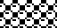
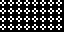

# 10 – Round

Round patterns.

## Gallery

| Pattern | Preview | Bitmap | Arduboy | Bitsy | PICO-8 | Thumby |
| :--- | :---: | :---: | :---: | :---: | :---: | :---: |
| Sphere o|  | [png](png/Sphere.png) | cpp | txt | lua | py
| SphereMini p|  | [png](png/SphereMini.png) | cpp | txt | lua | py

<!-- 
| AnnuletsSmall |  | [png](png/AnnuletsSmall.png) | cpp | txt | lua | py
| RoundelsSmall |  | [png](png/RoundelsSmall.png) | cpp | txt | lua | py
| RoundelSmall |  | [png](png/RoundelSmall.png) | cpp | txt | lua | py
| Annulet |  | [png](png/Annulet.png) | cpp | txt | lua | py
| AnnuletCoAnnulet |  | [png](png/Annulets.png) | cpp | txt | lua | py
| AnnuletCoAnnuletSquare |  | [png](png/Annulets-Square.png) | cpp | txt | lua | py
| AnnuletCoAnnuletXL |  | [png](png/Annulet-AnnuletLarge.png) | cpp | txt | lua | py
| Roundel-AnnuletExtraLarge |  | [png](png/Roundel-AnnuletExtraLarge.png) | cpp | txt | lua | py
| Roundel-Annulet |  | [png](png/Roundel-Annulet.png) | cpp | txt | lua | py
| Roundels |  | [png](png/Roundels.png) | cpp | txt | lua | py
| Roundel |  | [png](png/Roundel.png) | cpp | txt | lua | py
| Ball |  | [png](png/Ball.png) | cpp | txt | lua | py
 -->

[`⤴`](#gallery)

---

o: Pattern included in the `Office` collection  
p: Pattern included in the `PICO-8` collection 

 
