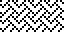
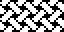
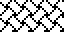
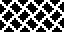
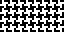
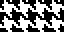
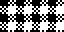
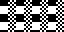
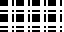

# 11 – Woven

Woven patterns.

## Gallery

| Pattern | Preview | Bitmap | Arduboy | Bitsy | PICO-8 | Thumby |
| :--- | :---: | :---: | :---: | :---: | :---: | :---: |
| Interlinked o|  | [png](png/Interlinked.png) | [cpp](Woven.h#L12-L23) | [txt](Woven.bitsy.txt#L5-L14) | [lua](woven.p8.lua#L7-L19) | [py](Woven.thumby.py#L5-L16) |
| WeaveDense |  | [png](png/WeaveDense.png) | [cpp](Woven.h#L25-L36) | [txt](Woven.bitsy.txt#L16-L25) | [lua](woven.p8.lua#L21-L33) | [py](Woven.thumby.py#L18-L29) |
| Weave |  | [png](png/Weave.png) | [cpp](Woven.h#L38-L49) | [txt](Woven.bitsy.txt#L27-L36) | [lua](woven.p8.lua#L35-L47) | [py](Woven.thumby.py#L31-L42) |
| WeaveMedium |  | [png](png/WeaveMedium.png) | [cpp](Woven.h#L51-L62) | [txt](Woven.bitsy.txt#L38-L47) | [lua](woven.p8.lua#L49-L61) | [py](Woven.thumby.py#L44-L55) |
| WeaveBold |  | [png](png/WeaveBold.png) | [cpp](Woven.h#L64-L75) | [txt](Woven.bitsy.txt#L49-L58) | [lua](woven.p8.lua#L63-L75) | [py](Woven.thumby.py#L57-L68) |
| Net |  | [png](png/Net.png) | [cpp](Woven.h#L77-L88) | [txt](Woven.bitsy.txt#L60-L69) | [lua](woven.p8.lua#L77-L89) | [py](Woven.thumby.py#L70-L81) |
| Wicker |  | [png](png/Wicker.png) | [cpp](Woven.h#L90-L101) | [txt](Woven.bitsy.txt#L71-L80) | [lua](woven.p8.lua#L91-L103) | [py](Woven.thumby.py#L83-L94) |
| Laced |  | [png](png/Laced.png) | [cpp](Woven.h#L103-L114) | [txt](Woven.bitsy.txt#L82-L91) | [lua](woven.p8.lua#L105-L117) | [py](Woven.thumby.py#L96-L107) |
| SquareBasket |  | [png](png/SquareBasket.png) | [cpp](Woven.h#L116-L127) | [txt](Woven.bitsy.txt#L93-L102) | [lua](woven.p8.lua#L119-L131) | [py](Woven.thumby.py#L109-L120) |
| Puppytooth p|  | [png](png/Puppytooth.png) | [cpp](Woven.h#L129-L141) | [txt](Woven.bitsy.txt#L104-L113) | [lua](woven.p8.lua#L133-L146) | [py](Woven.thumby.py#L122-L133) |
| Houndstooth |  | [png](png/Houndstooth.png) | [cpp](Woven.h#L143-L154) | [txt](Woven.bitsy.txt#L115-L124) | [lua](woven.p8.lua#L148-L160) | [py](Woven.thumby.py#L135-L146) |
| Gingham |  | [png](png/Gingham.png) | [cpp](Woven.h#L156-L167) | [txt](Woven.bitsy.txt#L126-L135) | [lua](woven.p8.lua#L162-L174) | [py](Woven.thumby.py#L148-L159) |
| Plaid |  | [png](png/Plaid.png) | [cpp](Woven.h#L169-L180) | [txt](Woven.bitsy.txt#L137-L146) | [lua](woven.p8.lua#L176-L188) | [py](Woven.thumby.py#L161-L172) |
| Tartan |  | [png](png/Tartan.png) | [cpp](Woven.h#L182-L193) | [txt](Woven.bitsy.txt#L148-L157) | [lua](woven.p8.lua#L190-L202) | [py](Woven.thumby.py#L174-L185) |

[`⤴`](#gallery)

---

o: Pattern included in the `Office` collection  
p: Pattern included in the `PICO-8` collection 

 
