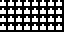

# 12 – Architecture

Architectural patterns.

## Gallery

| Pattern | Preview | Bitmap | Arduboy | Bitsy | PICO-8 | Thumby |
| :--- | :---: | :---: | :---: | :---: | :---: | :---: |
| BrickDense |  | [png](png/BrickDense.png) | [cpp](Architecture.h#L25-L36) | [txt](Architecture.bitsy.txt#L16-L25) | [p𝟪](architecture.p8.lua#L21-L33) | [py](Architecture.thumby.py#L18-L29) |
| BrickNarrow |  | [png](png/BrickNarrow.png) | [cpp](Architecture.h#L38-L49) | [txt](Architecture.bitsy.txt#L27-L36) | [p𝟪](architecture.p8.lua#L35-L47) | [py](Architecture.thumby.py#L31-L42) |
| BrickWide |  | [png](png/BrickWide.png) | [cpp](Architecture.h#L51-L62) | [txt](Architecture.bitsy.txt#L38-L47) | [p𝟪](architecture.p8.lua#L49-L61) | [py](Architecture.thumby.py#L44-L55) |
| Brick o|  | [png](png/Brick.png) | [cpp](Architecture.h#L12-L23) | [txt](Architecture.bitsy.txt#L5-L14) | [p𝟪](architecture.p8.lua#L7-L19) | [py](Architecture.thumby.py#L5-L16) |
| BrickAged |  | [png](png/BrickAged.png) | [cpp](Architecture.h#L64-L75) | [txt](Architecture.bitsy.txt#L49-L58) | [p𝟪](architecture.p8.lua#L63-L75) | [py](Architecture.thumby.py#L57-L68) |
| BrickPointed |  | [png](png/BrickPointed.png) | [cpp](Architecture.h#L77-L88) | [txt](Architecture.bitsy.txt#L60-L69) | [p𝟪](architecture.p8.lua#L77-L89) | [py](Architecture.thumby.py#L70-L81) |
| BrickShaded |  | [png](png/BrickShaded.png) | 
| BrickRelief |  | [png](png/BrickRelief.png) | 
| BrickSparse |  | [png](png/BrickSparse.png) | [cpp](Architecture.h#L90-L101) | [txt](Architecture.bitsy.txt#L71-L80) | [p𝟪](architecture.p8.lua#L91-L103) | [py](Architecture.thumby.py#L83-L94) |
| BrickSparseShaded |  | [png](png/BrickSparseShaded.png) | 
| BrickHighlights |  | [png](png/BrickHighlights.png) | [cpp](Architecture.h#L103-L114) | [txt](Architecture.bitsy.txt#L82-L91) | [p𝟪](architecture.p8.lua#L105-L117) | [py](Architecture.thumby.py#L96-L107) |
| Mortar |  | [png](png/Mortar.png) | 
| MortarLight |  | [png](png/MortarLight.png) | [cpp](Architecture.h#L116-L127) | [txt](Architecture.bitsy.txt#L93-L102) | [p𝟪](architecture.p8.lua#L119-L131) | [py](Architecture.thumby.py#L109-L120) |
| MortarAged |  | [png](png/MortarAged.png) | [cpp](Architecture.h#L129-L140) | [txt](Architecture.bitsy.txt#L104-L113) | [p𝟪](architecture.p8.lua#L133-L145) | [py](Architecture.thumby.py#L122-L133) |

 

| Pattern | Preview | Bitmap | Arduboy | Bitsy | PICO-8 | Thumby |
| :--- | :---: | :---: | :---: | :---: | :---: | :---: |
| BrickVertical |  | [png](png/BrickVertical.png) | [cpp](Architecture.h#L142-L153) | [txt](Architecture.bitsy.txt#L115-L124) | [p𝟪](architecture.p8.lua#L147-L159) | [py](Architecture.thumby.py#L135-L146) |
| BrickSinister o|  | [png](png/BrickSinister.png) | [cpp](Architecture.h#L155-L166) | [txt](Architecture.bitsy.txt#L126-L135) | [p𝟪](architecture.p8.lua#L161-L173) | [py](Architecture.thumby.py#L148-L159) |
| BrickSinisterRounded |  | [png](png/BrickSinisterRounded.png) | [cpp](Architecture.h#L168-L179) | [txt](Architecture.bitsy.txt#L137-L146) | [p𝟪](architecture.p8.lua#L175-L187) | [py](Architecture.thumby.py#L161-L172) |
| BrickSinisterMini |  | [png](png/BrickSinisterMini.png) | [cpp](Architecture.h#L181-L193) | [txt](Architecture.bitsy.txt#L148-L157) | [p𝟪](architecture.p8.lua#L189-L202) | [py](Architecture.thumby.py#L174-L185) |
| BrickMini |  | [png](png/BrickMini.png) | [cpp](Architecture.h#L195-L207) | [txt](Architecture.bitsy.txt#L159-L168) | [p𝟪](architecture.p8.lua#L204-L217) | [py](Architecture.thumby.py#L187-L198) |
| BrickMiniDamage |  | [png](png/BrickMiniDamage.png) | [cpp](Architecture.h#L209-L220) | [txt](Architecture.bitsy.txt#L170-L179) | [p𝟪](architecture.p8.lua#L219-L231) | [py](Architecture.thumby.py#L200-L211) |
| BrickMiniRuins |  | [png](png/BrickMiniRuins.png) | [cpp](Architecture.h#L222-L233) | [txt](Architecture.bitsy.txt#L181-L190) | [p𝟪](architecture.p8.lua#L233-L245) | [py](Architecture.thumby.py#L213-L224) |

 

| Pattern | Preview | Bitmap | Arduboy | Bitsy | PICO-8 | Thumby |
| :--- | :---: | :---: | :---: | :---: | :---: | :---: |
| StoneWall |  | [png](png/StoneWall.png) | [cpp](Architecture.h#L235-L246) | [txt](Architecture.bitsy.txt#L192-L201) | [p𝟪](architecture.p8.lua#L247-L259) | [py](Architecture.thumby.py#L226-L237) |
| QuarryWall |  | [png](png/QuarryWall.png) | [cpp](Architecture.h#L248-L259) | [txt](Architecture.bitsy.txt#L203-L212) | [p𝟪](architecture.p8.lua#L261-L273) | [py](Architecture.thumby.py#L239-L250) |
| StoneBlock |  | [png](png/StoneBlock.png) | [cpp](Architecture.h#L261-L272) | [txt](Architecture.bitsy.txt#L214-L223) | [p𝟪](architecture.p8.lua#L275-L287) | [py](Architecture.thumby.py#L252-L263) |
| Flagstone |  | [png](png/Flagstone.png) | [cpp](Architecture.h#L274-L285) | [txt](Architecture.bitsy.txt#L225-L234) | [p𝟪](architecture.p8.lua#L289-L301) | [py](Architecture.thumby.py#L265-L276) |
| PavingStones |  | [png](png/PavingStones.png) | [cpp](Architecture.h#L287-L298) | [txt](Architecture.bitsy.txt#L236-L245) | [p𝟪](architecture.p8.lua#L303-L315) | [py](Architecture.thumby.py#L278-L289) |
| Shingle o|  | [png](png/Shingle.png) | [cpp](Architecture.h#L300-L311) | [txt](Architecture.bitsy.txt#L247-L256) | [p𝟪](architecture.p8.lua#L317-L329) | [py](Architecture.thumby.py#L291-L302) |
| RoofTiles |  | [png](png/RoofTiles.png) | [cpp](Architecture.h#L313-L324) | [txt](Architecture.bitsy.txt#L258-L267) | [p𝟪](architecture.p8.lua#L331-L343) | [py](Architecture.thumby.py#L304-L315) |
| Archway |  | [png](png/Archway.png) | [cpp](Architecture.h#L326-L337) | [txt](Architecture.bitsy.txt#L269-L278) | [p𝟪](architecture.p8.lua#L345-L357) | [py](Architecture.thumby.py#L317-L328) |
| Window |  | [png](png/Window.png) | [cpp](Architecture.h#L339-L350) | [txt](Architecture.bitsy.txt#L280-L289) | [p𝟪](architecture.p8.lua#L359-L371) | [py](Architecture.thumby.py#L330-L341) |
| Planks |  | [png](png/Planks.png) | 
| Picket |  | [png](png/Picket.png) | [cpp](Architecture.h#L352-L363) | [txt](Architecture.bitsy.txt#L291-L300) | [p𝟪](architecture.p8.lua#L373-L385) | [py](Architecture.thumby.py#L343-L354) |
| House |  | [png](png/House.png) | 
| HouseMini p|  | [png](png/HouseMini.png) | 

[`⤴`](#gallery)

---

o: Pattern included in the `Office` collection  
p: Pattern included in the `PICO-8` collection 

 
