# 12 – Architecture

Architectural patterns.

## Gallery

| Pattern | Preview | Bitmap | Arduboy | Bitsy | PICO-8 | Thumby |
| :--- | :---: | :---: | :---: | :---: | :---: | :---: |
| Brick o|  | [png](png/Brick.png) | [cpp](Architecture.h#L12-L23) | [txt](Architecture.bitsy.txt#L5-L14) | [lua](architecture.p8.lua#L7-L19) | [py](Architecture.thumby.py#L5-L16) |
| BrickDense |  | [png](png/BrickDense.png) | [cpp](Architecture.h#L25-L36) | [txt](Architecture.bitsy.txt#L16-L25) | [lua](architecture.p8.lua#L21-L33) | [py](Architecture.thumby.py#L18-L29) |
| BrickNarrow |  | [png](png/BrickNarrow.png) | [cpp](Architecture.h#L38-L49) | [txt](Architecture.bitsy.txt#L27-L36) | [lua](architecture.p8.lua#L35-L47) | [py](Architecture.thumby.py#L31-L42) |
| BrickWide |  | [png](png/BrickWide.png) | [cpp](Architecture.h#L51-L62) | [txt](Architecture.bitsy.txt#L38-L47) | [lua](architecture.p8.lua#L49-L61) | [py](Architecture.thumby.py#L44-L55) |
| BrickAged |  | [png](png/BrickAged.png) | [cpp](Architecture.h#L64-L75) | [txt](Architecture.bitsy.txt#L49-L58) | [lua](architecture.p8.lua#L63-L75) | [py](Architecture.thumby.py#L57-L68) |
| BrickPretty | 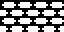 | [png](png/BrickPointed.png) | [cpp](Architecture.h#L77-L88) | [txt](Architecture.bitsy.txt#L60-L69) | [lua](architecture.p8.lua#L77-L89) | [py](Architecture.thumby.py#L70-L81) |
| BrickSparse | 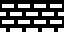 | [png](png/BrickSparse.png) | [cpp](Architecture.h#L90-L101) | [txt](Architecture.bitsy.txt#L71-L80) | [lua](architecture.p8.lua#L91-L103) | [py](Architecture.thumby.py#L83-L94) |
| BrickHighlights | 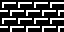 | [png](png/BrickHighlights.png) | [cpp](Architecture.h#L103-L114) | [txt](Architecture.bitsy.txt#L82-L91) | [lua](architecture.p8.lua#L105-L117) | [py](Architecture.thumby.py#L96-L107) |
| Mortar | 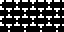 | [png](png/Mortar.png) | [cpp](Architecture.h#L116-L127) | [txt](Architecture.bitsy.txt#L93-L102) | [lua](architecture.p8.lua#L119-L131) | [py](Architecture.thumby.py#L109-L120) |
| MortarAged | 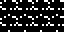 | [png](png/MortarAged.png) | [cpp](Architecture.h#L129-L140) | [txt](Architecture.bitsy.txt#L104-L113) | [lua](architecture.p8.lua#L133-L145) | [py](Architecture.thumby.py#L122-L133) |
| BrickVertical |  | [png](png/BrickVertical.png) | cpp | txt | lua | py
| BrickSinister o|  | [png](png/BrickSinister.png) | cpp | txt | lua | py
| BrickSinisterRounded|  | [png](png/BrickSinisterRounded.png) | cpp | txt | lua | py
| BrickSinisterMini |  | [png](png/BrickSinisterMini.png) | cpp | txt | lua | py
| BrickMini | 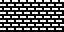 | [png](png/BrickMini.png) | cpp | txt | lua | py
| BrickMiniDamage | 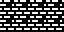 | [png](png/BrickMiniDamage.png) | cpp | txt | lua | py
| BrickMiniRuins |  | [png](png/BrickMiniRuins.png) | cpp | txt | lua | py

 

| Pattern | Preview | Bitmap | Arduboy | Bitsy | PICO-8 | Thumby |
| :--- | :---: | :---: | :---: | :---: | :---: | :---: |
| StoneWall | 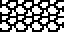 | [png](png/StoneWall.png) | cpp | txt | lua | py
| QuarryWall |  | [png](png/QuarryWall.png) | cpp | txt | lua | py
| StoneBlock |  | [png](png/StoneBlock.png) | cpp | txt | lua | py
| Flagstone |  | [png](png/Flagstone.png) | cpp | txt | lua | py
| PavingStones |  | [png](png/PavingStones.png) | cpp | txt | lua | py
| Shingle o| 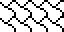 | [png](png/Shingle.png) | cpp | txt | lua | py
| RoofTiles |  | [png](png/RoofTiles.png) | cpp | txt | lua | py
| Archway |  | [png](png/Archway.png) | cpp | txt | lua | py
| Window | 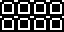 | [png](png/Window.png) | cpp | txt | lua | py
| Picket | 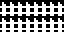 | [png](png/Picket.png) | cpp | txt | lua | py

[`⤴`](#gallery)

---

o: Pattern included in the `Office` collection  
p: Pattern included in the `PICO-8` collection 

 
