# 13 – Nature

Nature patterns.

## Gallery

| Pattern | Preview | Bitmap | Arduboy | Bitsy | PICO-8 | Playdate | Thumby |
| :------ | :-----: | :----: | :-----: | :---: | :----: | :------: | :----: |
| ScalesSparse | 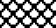 | [png](png/ScalesSparse.png) | [cpp](Nature.h#L12-L23) | [txt](Nature.bitsy.txt#L5-L14) | [p𝟪](nature.p8.lua#L7-L19) | [lua](Nature.playdate.lua#L5-L17) | [py](Nature.thumby.py#L5-L16) |
| Scales |  | [png](png/Scales.png) | [cpp](Nature.h#L25-L36) | [txt](Nature.bitsy.txt#L16-L25) | [p𝟪](nature.p8.lua#L21-L33) | [lua](Nature.playdate.lua#L19-L31) | [py](Nature.thumby.py#L18-L29) |
| Scallop | 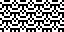 | [png](png/Scallop.png) | [cpp](Nature.h#L38-L49) | [txt](Nature.bitsy.txt#L27-L36) | [p𝟪](nature.p8.lua#L35-L47) | [lua](Nature.playdate.lua#L33-L45) | [py](Nature.thumby.py#L31-L42) |
| ScalesLargeDexter | 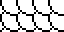 | [png](png/ScalesLargeDexter.png) | [cpp](Nature.h#L51-L62) | [txt](Nature.bitsy.txt#L38-L47) | [p𝟪](nature.p8.lua#L49-L61) | [lua](Nature.playdate.lua#L47-L59) | [py](Nature.thumby.py#L44-L55) |
| ScalesLargeSinister |  | [png](png/ScalesLargeSinister.png) | [cpp](Nature.h#L64-L75) | [txt](Nature.bitsy.txt#L49-L58) | [p𝟪](nature.p8.lua#L63-L75) | [lua](Nature.playdate.lua#L61-L73) | [py](Nature.thumby.py#L57-L68) |
| Papillon |  | [png](png/Papillon.png) | [cpp](Nature.h#L77-L88) | [txt](Nature.bitsy.txt#L60-L69) | [p𝟪](nature.p8.lua#L77-L89) | [lua](Nature.playdate.lua#L75-L87) | [py](Nature.thumby.py#L70-L81) |

 

| Pattern | Preview | Bitmap | Arduboy | Bitsy | PICO-8 | Playdate | Thumby |
| :------ | :-----: | :----: | :-----: | :---: | :----: | :------: | :----: |
| Loam |  | [png](png/Loam.png) | [cpp](Nature.h#L90-L101) | [txt](Nature.bitsy.txt#L71-L80) | [p𝟪](nature.p8.lua#L91-L103) | [lua](Nature.playdate.lua#L89-L101) | [py](Nature.thumby.py#L83-L94) |
| Sand |  | [png](png/Sand.png) | [cpp](Nature.h#L103-L114) | [txt](Nature.bitsy.txt#L82-L91) | [p𝟪](nature.p8.lua#L105-L117) | [lua](Nature.playdate.lua#L103-L115) | [py](Nature.thumby.py#L96-L107) |
| Striated | 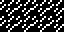 | [png](png/Striated.png) |
| Trail | 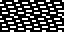 | [png](png/Trail.png) |
| Patch |  | [png](png/Patch.png) | [cpp](Nature.h#L116-L127) | [txt](Nature.bitsy.txt#L93-L102) | [p𝟪](nature.p8.lua#L119-L131) | [lua](Nature.playdate.lua#L117-L129) | [py](Nature.thumby.py#L109-L120) |
| Divot o|  | [png](png/Divot.png) | [cpp](Nature.h#L129-L140) | [txt](Nature.bitsy.txt#L104-L113) | [p𝟪](nature.p8.lua#L133-L145) | [lua](Nature.playdate.lua#L131-L143) | [py](Nature.thumby.py#L122-L133) |
| Grass | 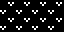 | [png](png/Grass.png) | [cpp](Nature.h#L142-L153) | [txt](Nature.bitsy.txt#L115-L124) | [p𝟪](nature.p8.lua#L147-L159) | [lua](Nature.playdate.lua#L145-L157) | [py](Nature.thumby.py#L135-L146) |
| GrassMini p|  | [png](png/GrassMini.png) | [cpp](Nature.h#L155-L167) | [txt](Nature.bitsy.txt#L126-L135) | [p𝟪](nature.p8.lua#L161-L174) | [lua](Nature.playdate.lua#L159-L171) | [py](Nature.thumby.py#L148-L159) |
| Field |  | [png](png/Field.png) | [cpp](Nature.h#L169-L180) | [txt](Nature.bitsy.txt#L137-L146) | [p𝟪](nature.p8.lua#L176-L188) | [lua](Nature.playdate.lua#L173-L185) | [py](Nature.thumby.py#L161-L172) |
| FieldSparse |  | [png](png/FieldSparse.png) | [cpp](Nature.h#L182-L193) | [txt](Nature.bitsy.txt#L148-L157) | [p𝟪](nature.p8.lua#L190-L202) | [lua](Nature.playdate.lua#L187-L199) | [py](Nature.thumby.py#L174-L185) |
| Pasture |  | [png](png/Pasture.png) | [cpp](Nature.h#L195-L206) | [txt](Nature.bitsy.txt#L159-L168) | [p𝟪](nature.p8.lua#L204-L216) | [lua](Nature.playdate.lua#L201-L213) | [py](Nature.thumby.py#L187-L198) |

 

| Pattern | Preview | Bitmap | Arduboy | Bitsy | PICO-8 | Playdate | Thumby |
| :------ | :-----: | :----: | :-----: | :---: | :----: | :------: | :----: |
| Daisies | 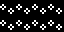 | [png](png/Daisies.png) | [cpp](Nature.h#L208-L219) | [txt](Nature.bitsy.txt#L170-L179) | [p𝟪](nature.p8.lua#L218-L230) | [lua](Nature.playdate.lua#L215-L227) | [py](Nature.thumby.py#L200-L211) |
| Tuffet |  | [png](png/Tuffet.png) | [cpp](Nature.h#L221-L232) | [txt](Nature.bitsy.txt#L181-L190) | [p𝟪](nature.p8.lua#L232-L244) | [lua](Nature.playdate.lua#L229-L241) | [py](Nature.thumby.py#L213-L224) |
| Shrub |  | [png](png/Shrub.png) | [cpp](Nature.h#L234-L245) | [txt](Nature.bitsy.txt#L192-L201) | [p𝟪](nature.p8.lua#L246-L258) | [lua](Nature.playdate.lua#L243-L255) | [py](Nature.thumby.py#L226-L237) |
| Sprout | 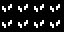 | [png](png/Sprout.png) | [cpp](Nature.h#L247-L258) | [txt](Nature.bitsy.txt#L203-L212) | [p𝟪](nature.p8.lua#L260-L272) | [lua](Nature.playdate.lua#L257-L269) | [py](Nature.thumby.py#L239-L250) |
| Crop |  | [png](png/Crop.png) | [cpp](Nature.h#L260-L271) | [txt](Nature.bitsy.txt#L214-L223) | [p𝟪](nature.p8.lua#L274-L286) | [lua](Nature.playdate.lua#L271-L283) | [py](Nature.thumby.py#L252-L263) |
| Bush |  | [png](png/Bush.png) | [cpp](Nature.h#L273-L284) | [txt](Nature.bitsy.txt#L225-L234) | [p𝟪](nature.p8.lua#L288-L300) | [lua](Nature.playdate.lua#L285-L297) | [py](Nature.thumby.py#L265-L276) |
| Leaves | 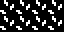 | [png](png/Leaves.png) | [cpp](Nature.h#L286-L297) | [txt](Nature.bitsy.txt#L236-L245) | [p𝟪](nature.p8.lua#L302-L314) | [lua](Nature.playdate.lua#L299-L311) | [py](Nature.thumby.py#L278-L289) |
| Overgrowth |  | [png](png/Overgrowth.png) | [cpp](Nature.h#L299-L310) | [txt](Nature.bitsy.txt#L247-L256) | [p𝟪](nature.p8.lua#L316-L328) | [lua](Nature.playdate.lua#L313-L325) | [py](Nature.thumby.py#L291-L302) |

 

| Pattern | Preview | Bitmap | Arduboy | Bitsy | PICO-8 | Playdate | Thumby |
| :------ | :-----: | :----: | :-----: | :---: | :----: | :------: | :----: |
| Thicket | 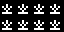 | [png](png/Thicket.png) | [cpp](Nature.h#L312-L323) | [txt](Nature.bitsy.txt#L258-L267) | [p𝟪](nature.p8.lua#L330-L342) | [lua](Nature.playdate.lua#L327-L339) | [py](Nature.thumby.py#L304-L315) |
| Tree |  | [png](png/Tree.png) | [cpp](Nature.h#L325-L336) | [txt](Nature.bitsy.txt#L269-L278) | [p𝟪](nature.p8.lua#L344-L356) | [lua](Nature.playdate.lua#L341-L353) | [py](Nature.thumby.py#L317-L328) |
| Arboreal |  | [png](png/Arboreal.png)
| Rocks |  | [png](png/Rocks.png) | [cpp](Nature.h#L338-L349) | [txt](Nature.bitsy.txt#L280-L289) | [p𝟪](nature.p8.lua#L358-L370) | [lua](Nature.playdate.lua#L355-L367) | [py](Nature.thumby.py#L330-L341) |
| Mounds | 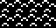 | [png](png/Mounds.png) | [cpp](Nature.h#L351-L362) | [txt](Nature.bitsy.txt#L291-L300) | [p𝟪](nature.p8.lua#L372-L384) | [lua](Nature.playdate.lua#L369-L381) | [py](Nature.thumby.py#L343-L354) |
| Skull |  | [png](png/Skull.png) | [cpp](Nature.h#L364-L375) | [txt](Nature.bitsy.txt#L302-L311) | [p𝟪](nature.p8.lua#L386-L398) | [lua](Nature.playdate.lua#L383-L395) | [py](Nature.thumby.py#L356-L367) |
| SkullLarge | 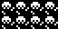 | [png](png/SkullLarge.png) | [cpp](Nature.h#L377-L388) | [txt](Nature.bitsy.txt#L313-L322) | [p𝟪](nature.p8.lua#L400-L412) | [lua](Nature.playdate.lua#L397-L409) | [py](Nature.thumby.py#L369-L380) |
| SkullXL |  | [png](png/SkullXL.png) | [cpp](Nature.h#L390-L401) | [txt](Nature.bitsy.txt#L324-L333) | [p𝟪](nature.p8.lua#L414-L426) | [lua](Nature.playdate.lua#L411-L423) | [py](Nature.thumby.py#L382-L393) |
| CrackedBoulder |  | [png](png/CrackedBoulder.png) | [cpp](Nature.h#L403-L414) | [txt](Nature.bitsy.txt#L335-L344) | [p𝟪](nature.p8.lua#L428-L440) | [lua](Nature.playdate.lua#L425-L437) | [py](Nature.thumby.py#L395-L406) |
| Bamboo |  | [png](png/Bamboo.png) | [cpp](Nature.h#L416-L427) | [txt](Nature.bitsy.txt#L346-L355) | [p𝟪](nature.p8.lua#L442-L454) | [lua](Nature.playdate.lua#L439-L451) | [py](Nature.thumby.py#L408-L419) |

[`⤴`](#gallery)

---

o: Pattern included in the `Office` collection  
p: Pattern included in the `PICO-8` collection

 
