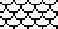
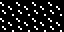
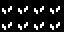
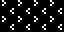
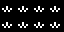
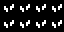
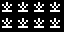
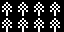
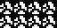
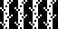

# 13 – Nature

Nature patterns.

## Gallery

| Pattern | Preview | Bitmap | Arduboy | Bitsy | PICO-8 | Thumby |
| :--- | :---: | :---: | :---: | :---: | :---: | :---: |
| Scales |  | [png](png/Scales.png) | [cpp](Nature.h#L12-L23) | [txt](Nature.bitsy.txt#L5-L14) | [lua](nature.p8.lua#L7-L19) | [py](Nature.thumby.py#L5-L16) |
| Loam |  | [png](png/Loam.png) | [cpp](Nature.h#L25-L36) | [txt](Nature.bitsy.txt#L16-L25) | [lua](nature.p8.lua#L21-L33) | [py](Nature.thumby.py#L18-L29) |
| Sand |  | [png](png/Sand.png) | [cpp](Nature.h#L38-L49) | [txt](Nature.bitsy.txt#L27-L36) | [lua](nature.p8.lua#L35-L47) | [py](Nature.thumby.py#L31-L42) |
| Grass |  | [png](png/Grass.png) | [cpp](Nature.h#L51-L62) | [txt](Nature.bitsy.txt#L38-L47) | [lua](nature.p8.lua#L49-L61) | [py](Nature.thumby.py#L44-L55) |
| Divot o|  | [png](png/Divot.png) | [cpp](Nature.h#L64-L75) | [txt](Nature.bitsy.txt#L49-L58) | [lua](nature.p8.lua#L63-L75) | [py](Nature.thumby.py#L57-L68) |
| Pasture |  | [png](png/Pasture.png) | [cpp](Nature.h#L77-L88) | [txt](Nature.bitsy.txt#L60-L69) | [lua](nature.p8.lua#L77-L89) | [py](Nature.thumby.py#L70-L81) |
| Daisies |  | [png](png/Daisies.png) | [cpp](Nature.h#L90-L101) | [txt](Nature.bitsy.txt#L71-L80) | [lua](nature.p8.lua#L91-L103) | [py](Nature.thumby.py#L83-L94) |
| Tuffet |  | [png](png/Tuffet.png) | [cpp](Nature.h#L103-L114) | [txt](Nature.bitsy.txt#L82-L91) | [lua](nature.p8.lua#L105-L117) | [py](Nature.thumby.py#L96-L107) |
| Shrub |  | [png](png/Shrub.png) | [cpp](Nature.h#L116-L127) | [txt](Nature.bitsy.txt#L93-L102) | [lua](nature.p8.lua#L119-L131) | [py](Nature.thumby.py#L109-L120) |
| Leaves |  | [png](png/Leaves.png) | [cpp](Nature.h#L129-L140) | [txt](Nature.bitsy.txt#L104-L113) | [lua](nature.p8.lua#L133-L145) | [py](Nature.thumby.py#L122-L133) |
| Crop |  | [png](png/Crop.png) | [cpp](Nature.h#L142-L153) | [txt](Nature.bitsy.txt#L115-L124) | [lua](nature.p8.lua#L147-L159) | [py](Nature.thumby.py#L135-L146) |
| Bush |  | [png](png/Bush.png) | [cpp](Nature.h#L155-L166) | [txt](Nature.bitsy.txt#L126-L135) | [lua](nature.p8.lua#L161-L173) | [py](Nature.thumby.py#L148-L159) |
| Thicket |  | [png](png/Thicket.png) | [cpp](Nature.h#L168-L179) | [txt](Nature.bitsy.txt#L137-L146) | [lua](nature.p8.lua#L175-L187) | [py](Nature.thumby.py#L161-L172) |
| Tree |  | [png](png/Tree.png) | [cpp](Nature.h#L181-L192) | [txt](Nature.bitsy.txt#L148-L157) | [lua](nature.p8.lua#L189-L201) | [py](Nature.thumby.py#L174-L185) |
| Rocks |  | [png](png/Rocks.png) | [cpp](Nature.h#L194-L205) | [txt](Nature.bitsy.txt#L159-L168) | [lua](nature.p8.lua#L203-L215) | [py](Nature.thumby.py#L187-L198) |
| Mounds |  | [png](png/Mounds.png) | [cpp](Nature.h#L207-L218) | [txt](Nature.bitsy.txt#L170-L179) | [lua](nature.p8.lua#L217-L229) | [py](Nature.thumby.py#L200-L211) |
| Skull |  | [png](png/Skull.png) | [cpp](Nature.h#L220-L231) | [txt](Nature.bitsy.txt#L181-L190) | [lua](nature.p8.lua#L231-L243) | [py](Nature.thumby.py#L213-L224) |
| CrackedBoulder |  | [png](png/CrackedBoulder.png) | [cpp](Nature.h#L233-L244) | [txt](Nature.bitsy.txt#L192-L201) | [lua](nature.p8.lua#L245-L257) | [py](Nature.thumby.py#L226-L237) |
| BeanStalk |  | [png](png/BeanStalk.png) | [cpp](Nature.h#L246-L257) | [txt](Nature.bitsy.txt#L203-L212) | [lua](nature.p8.lua#L259-L271) | [py](Nature.thumby.py#L239-L250) |

[`⤴`](#gallery)

---

o: Pattern included in the `Office` collection  
p: Pattern included in the `PICO-8` collection 

 
