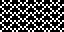
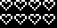
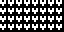
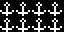
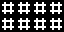
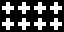
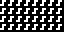
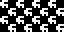

# 14 – Symbols

Symbolic patterns.

## Gallery

| Pattern | Preview | Bitmap | Arduboy | Bitsy | PICO-8 | Thumby |
| :--- | :---: | :---: | :---: | :---: | :---: | :---: |
| Love |  | [png](png/Love.png) | [cpp](Symbols.h#L12-L23) | [txt](Symbols.bitsy.txt#L5-L14) | [p𝟪](symbols.p8.lua#L7-L19) | [py](Symbols.thumby.py#L5-L16)
| Heart |  | [png](png/Heart.png) | [cpp](Symbols.h#L25-L36) | [txt](Symbols.bitsy.txt#L16-L25) | [p𝟪](symbols.p8.lua#L21-L33) | [py](Symbols.thumby.py#L18-L29) |
| HeartMini p|  | [png](png/HeartMini.png) | [cpp](Symbols.h#L38-L50) | [txt](Symbols.bitsy.txt#L27-L36) | [p𝟪](symbols.p8.lua#L35-L48) | [py](Symbols.thumby.py#L31-L42) |
| Anchor |  | [png](png/Anchor.png) | [cpp](Symbols.h#L52-L63) | [txt](Symbols.bitsy.txt#L38-L47) | [p𝟪](symbols.p8.lua#L50-L62) | [py](Symbols.thumby.py#L44-L55) |
| Crossbones |  | [png](png/Crossbones.png) | [cpp](Symbols.h#L65-L76) | [txt](Symbols.bitsy.txt#L49-L58) | [p𝟪](symbols.p8.lua#L64-L76) | [py](Symbols.thumby.py#L57-L68)
| Octothorp |  | [png](png/Octothorp.png) | | | | |
| Cross |  | [png](png/Cross.png) | [cpp](Symbols.h#L78-L89) | [txt](Symbols.bitsy.txt#L60-L69) |[p𝟪](symbols.p8.lua#L78-L90)  | [py](Symbols.thumby.py#L70-L81)
| CrossMini p|  | [png](png/CrossMini.png) | [cpp](Symbols.h#L91-L103) | [txt](Symbols.bitsy.txt#L71-L80) | [p𝟪](symbols.p8.lua#L92-L105) | [py](Symbols.thumby.py#L83-L94)
| QuaverMini p|    | [png](png/QuaverMini.png) | | | | |
| Amongi |  | [png](png/Amongi.png) | [cpp](Symbols.h#L105-L116) | [txt](Symbols.bitsy.txt#L82-L91) | [p𝟪](symbols.p8.lua#L107-L119) | [py](Symbols.thumby.py#L96-L107)

[`⤴`](#gallery)

---

o: Pattern included in the `Office` collection  
p: Pattern included in the `PICO-8` collection 

 
