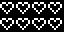
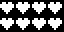
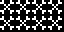
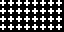
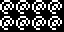
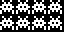
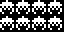
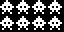

# 14 – Symbols

Symbolic patterns.

## Gallery

| Pattern | Preview | Bitmap | Arduboy | Bitsy | PICO-8 | Playdate | Thumby |
| :------ | :-----: | :----: | :-----: | :---: | :----: | :------: | :----: |
| Love |  | [png](png/Love.png) | [cpp](Symbols.h#L12-L23) | [txt](Symbols.bitsy.txt#L5-L14) | [p𝟪](symbols.p8.lua#L7-L19) | [lua](Symbols.playdate.lua#L5-L17) | [py](Symbols.thumby.py#L5-L16) |
| Heart |  | [png](png/Heart.png) | [cpp](Symbols.h#L25-L36) | [txt](Symbols.bitsy.txt#L16-L25) | [p𝟪](symbols.p8.lua#L21-L33) | [lua](Symbols.playdate.lua#L19-L31) | [py](Symbols.thumby.py#L18-L29) |
| HeartSolid |  | [png](png/HeartSolid.png) | [cpp](Symbols.h#L38-L49) | [txt](Symbols.bitsy.txt#L27-L36) | [p𝟪](symbols.p8.lua#L35-L47) | [lua](Symbols.playdate.lua#L33-L45) | [py](Symbols.thumby.py#L31-L42) |
| HeartMini p|  | [png](png/HeartMini.png) | [cpp](Symbols.h#L51-L63) | [txt](Symbols.bitsy.txt#L38-L47) | [p𝟪](symbols.p8.lua#L49-L62) | [lua](Symbols.playdate.lua#L47-L59) | [py](Symbols.thumby.py#L44-L55) |
| Quaver |  | [png](png/Quaver.png) | [cpp](Symbols.h#L65-L76) | [txt](Symbols.bitsy.txt#L49-L58) | [p𝟪](symbols.p8.lua#L64-L76) | [lua](Symbols.playdate.lua#L61-L73) | [py](Symbols.thumby.py#L57-L68) |
| QuaverMini p|  | [png](png/QuaverMini.png) | [cpp](Symbols.h#L78-L90) | [txt](Symbols.bitsy.txt#L60-L69) | [p𝟪](symbols.p8.lua#L78-L91) | [lua](Symbols.playdate.lua#L75-L87) | [py](Symbols.thumby.py#L70-L81) |
| Anchor |  | [png](png/Anchor.png) | [cpp](Symbols.h#L92-L103) | [txt](Symbols.bitsy.txt#L71-L80) | [p𝟪](symbols.p8.lua#L93-L105) | [lua](Symbols.playdate.lua#L89-L101) | [py](Symbols.thumby.py#L83-L94) |
| Crossbones |  | [png](png/Crossbones.png) | [cpp](Symbols.h#L105-L116) | [txt](Symbols.bitsy.txt#L82-L91) | [p𝟪](symbols.p8.lua#L107-L119) | [lua](Symbols.playdate.lua#L103-L115) | [py](Symbols.thumby.py#L96-L107) |
| Octothorp |  | [png](png/Octothorp.png) | [cpp](Symbols.h#L118-L129) | [txt](Symbols.bitsy.txt#L93-L102) | [p𝟪](symbols.p8.lua#L121-L133) | [lua](Symbols.playdate.lua#L117-L129) | [py](Symbols.thumby.py#L109-L120) |
| Cross |  | [png](png/Cross.png) | [cpp](Symbols.h#L131-L142) | [txt](Symbols.bitsy.txt#L104-L113) | [p𝟪](symbols.p8.lua#L135-L147) | [lua](Symbols.playdate.lua#L131-L143) | [py](Symbols.thumby.py#L122-L133) |
| CrossMini p|  | [png](png/CrossMini.png) | [cpp](Symbols.h#L144-L156) | [txt](Symbols.bitsy.txt#L115-L124) | [p𝟪](symbols.p8.lua#L149-L162) | [lua](Symbols.playdate.lua#L145-L157) | [py](Symbols.thumby.py#L135-L146) |
| Atto |  | [png](png/Atto.png) | [cpp](Symbols.h#L158-L169) | [txt](Symbols.bitsy.txt#L126-L135) | [p𝟪](symbols.p8.lua#L164-L176) | [lua](Symbols.playdate.lua#L159-L171) | [py](Symbols.thumby.py#L148-L159) |

 

| Pattern | Preview | Bitmap | Arduboy | Bitsy | PICO-8 | Playdate | Thumby |
| :------ | :-----: | :----: | :-----: | :---: | :----: | :------: | :----: |
| Amongi |  | [png](png/Amongi.png) | [cpp](Symbols.h#L171-L182) | [txt](Symbols.bitsy.txt#L137-L146) | [p𝟪](symbols.p8.lua#L178-L190) | [lua](Symbols.playdate.lua#L173-L185) | [py](Symbols.thumby.py#L161-L172) |
| InvadingBug |  | [png](png/InvadingBug.png) | [cpp](Symbols.h#L184-L195) | [txt](Symbols.bitsy.txt#L148-L157) | [p𝟪](symbols.p8.lua#L192-L204) | [lua](Symbols.playdate.lua#L187-L199) | [py](Symbols.thumby.py#L174-L185) |
| InvadingCrab |  | [png](png/InvadingCrab.png) | [cpp](Symbols.h#L197-L208) | [txt](Symbols.bitsy.txt#L159-L168) | [p𝟪](symbols.p8.lua#L206-L218) | [lua](Symbols.playdate.lua#L201-L213) | [py](Symbols.thumby.py#L187-L198) |
| InvadingSquid |  | [png](png/InvadingSquid.png) | [cpp](Symbols.h#L210-L221) | [txt](Symbols.bitsy.txt#L170-L179) | [p𝟪](symbols.p8.lua#L220-L232) | [lua](Symbols.playdate.lua#L215-L227) | [py](Symbols.thumby.py#L200-L211) |

[`⤴`](#gallery)

---

o: Pattern included in the `Office` collection  
p: Pattern included in the `PICO-8` collection

 
