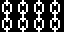
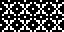
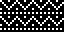

# 15 – Other

Other patterns.

## Gallery

| Pattern | Preview | Bitmap | Arduboy | Bitsy | PICO-8 | Playdate | Thumby |
| :------ | :-----: | :----: | :-----: | :---: | :----: | :------: | :----: |
| Chain |  | [png](png/Chain.png) | [cpp](Other.h#L12-L23) | [txt](Other.bitsy.txt#L5-L14) | [p𝟪](other.p8.lua#L7-L19) | [lua](Other.playdate.lua#L5-L17) | [py](Other.thumby.py#L5-L16) |
| ChainLarge |  | [png](png/ChainLarge.png) | [cpp](Other.h#L25-L36) | [txt](Other.bitsy.txt#L16-L25) | [p𝟪](other.p8.lua#L21-L33) | [lua](Other.playdate.lua#L19-L31) | [py](Other.thumby.py#L18-L29) |
| Rosette |  | [png](png/Rosette.png) | [cpp](Other.h#L38-L49) | [txt](Other.bitsy.txt#L27-L36) | [p𝟪](other.p8.lua#L35-L47) | [lua](Other.playdate.lua#L33-L45) | [py](Other.thumby.py#L31-L42) |
| Snowflake |  | [png](png/Snowflake.png) | [cpp](Other.h#L51-L62) | [txt](Other.bitsy.txt#L38-L47) | [p𝟪](other.p8.lua#L49-L61) | [lua](Other.playdate.lua#L47-L59) | [py](Other.thumby.py#L44-L55) |
| Festive |  | [png](png/Festive.png) | [cpp](Other.h#L64-L75) | [txt](Other.bitsy.txt#L49-L58) | [p𝟪](other.p8.lua#L63-L75) | [lua](Other.playdate.lua#L61-L73) | [py](Other.thumby.py#L57-L68) |
| Yuletide |  | [png](png/Yuletide.png) | [cpp](Other.h#L77-L88) | [txt](Other.bitsy.txt#L60-L69) | [p𝟪](other.p8.lua#L77-L89) | [lua](Other.playdate.lua#L75-L87) | [py](Other.thumby.py#L70-L81) |

[`⤴`](#gallery)

---

o: Pattern included in the `Office` collection  
p: Pattern included in the `PICO-8` collection

 
