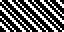
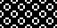

# 8x8.me

1 bit per pixel (monotone)  
8×8 pixels (8 bytes)  
Repeating tile fill patterns  

---
 

## Introduction

*Work in progress* ~ a collection of 'retro' fill patterns. Lovingly crafted and translated to convenient code snippets. Please keep the pixel gnomes fed with a [star](https://github.com/ace-dent/8x8.me/stargazers)! ⭐️

 

## Galleries
  
 &emsp; [01 – Dither](/01-Dither/README.md#gallery)  
 &emsp; [02 – Dots](/02-Dots/README.md#gallery)  
 &emsp; [03 – Dashes](/03-Dashes/README.md#gallery)  
 &emsp; [04 – Lines](/04-Lines/README.md#gallery)  
 &emsp; [05 – Waves](/05-Waves/README.md#gallery)  
 &emsp; [06 – Grid](/06-Grid/README.md#gallery)  
 &emsp; [07 – Checked](/07-Checked/README.md#gallery)  
 &emsp; [08 – Rectilinear](/08-Rectilinear/README.md#gallery)  
 &emsp; [09 – Radial](/09-Radial/README.md#gallery)  
 &emsp; [10 – Round](/10-Round/README.md#gallery)  
 &emsp; [11 – Woven](/11-Woven/README.md#gallery)  
 &emsp; [12 – Architecture](/12-Architecture/README.md#gallery)  
 &emsp; [13 – Nature](/13-Nature/README.md#gallery)  
 &emsp; [14 – Symbols](/14-Symbols/README.md#gallery)  
 &emsp; [15 – Other](/15-Other/README.md#gallery)

 

## Acknowledgements

Inspired by studying software from the mid 1980's, to video games of the early 1990's. Influenced by the wonderful pixel artists of today. All artwork is drawn *tabula rasa*. Please let me know if any designs resemble the work of others.

Artwork and files created using [ABSpriteEditor](https://github.com/Pharap/ABSpriteEditor). Patterns tested and refined using [ASE](https://github.com/pmwasson/ASE), [bitsy](https://ledoux.itch.io/bitsy) and [Pulp](https://play.date/pulp/about/). Data tweaking in LibreOffice. Image wrangling with ImageMagick, compressed with OptiPNG and `pngslim`, and metadata added with ExifTool.

Special thanks to @castpixel, @dw817, @felipemanga, @javl, @le-doux, @lexaloffle, @MrBlinky, @Pharap, @pmwasson, @scotthall92, @TPS.

 

## Legal
Produced by Andrew C.E. Dent and dedicated to the Public Domain (CC0 – free to use). Giving attribution is not required but always appreciated! Please read the separate `LICENSE` file.

All trademarks are the property of their respective owners.  
&emsp; *Arduboy*® is a registered trademark of [Arduboy, Inc., USA](https://www.arduboy.com).  
&emsp; *Bitsy* is produced by [Adam Le Doux](https://bitsy.org).  
&emsp; *GAMBY* was produced by [Logicalzero](http://logicalzero.com/gamby/) (David Stokes).  
&emsp; *LibreOffice* is a trademark of [The Document Foundation](https://www.libreoffice.org).  
&emsp; *PICO-8* and *Picotron* are trademarks of [Lexaloffle Games LLP](https://www.lexaloffle.com).  
&emsp; *Playdate*® and *Pulp* are trademarks of [Panic Inc., USA](https://shop.play.date/en-gb).  
&emsp; *Thumby* is a trademark of AkroSense LLC, USA / [TinyCircuits](https://thumby.us).
